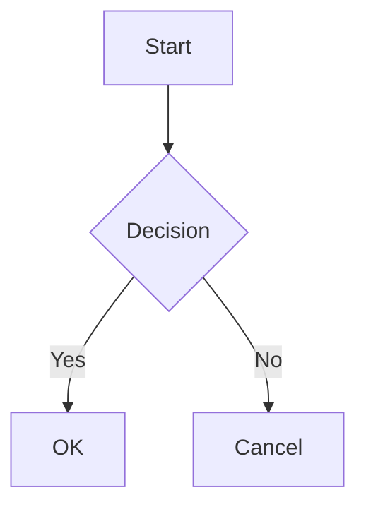

# Editeur Markdown - Documentation Technique

## Vue d'ensemble

L'éditeur Markdown de PlumeNote est basé sur **CodeMirror 6** et offre une expérience d'édition similaire à Obsidian, avec un mode édition (syntaxe visible) et un mode aperçu (rendu HTML).

**Fichier principal** : `apps/web/src/components/editor/MarkdownEditor.tsx`

## Architecture

```
MarkdownEditor.tsx
├── Callouts Obsidian (parsing + rendu)
├── Thème CodeMirror (styles visuels)
├── Extensions CodeMirror (fonctionnalités)
├── Toolbar (barre d'outils)
└── Composant principal (état, modes, handlers)
```

## Dépendances

```json
{
  "@codemirror/state": "^6.x",
  "@codemirror/view": "^6.x",
  "@codemirror/commands": "^6.x",
  "@codemirror/lang-markdown": "^6.x",
  "@codemirror/language": "^6.x",
  "@codemirror/language-data": "^6.x",
  "@codemirror/search": "^6.x",
  "@codemirror/autocomplete": "^6.x",
  "@lezer/highlight": "^1.x",
  "react-markdown": "^9.x",
  "remark-gfm": "^4.x",
  "remark-breaks": "^4.x",
  "mermaid": "^11.x"
}
```

---

## Système de Callouts Obsidian

### Syntaxe

Les callouts utilisent la syntaxe Obsidian standard :

```markdown
> [!TYPE] Titre optionnel
> Contenu du callout
> Sur plusieurs lignes
```

### Types supportés

| Type | Alias | Couleur | Description |
|------|-------|---------|-------------|
| `NOTE` | `INFO` | Bleu | Information générale |
| `TIP` | `HINT` | Cyan | Astuce, conseil |
| `WARNING` | `ATTENTION` | Orange | Avertissement |
| `IMPORTANT` | - | Cyan | Point important |
| `CAUTION` | - | Rouge | Prudence requise |
| `DANGER` | - | Rouge | Danger |
| `SUCCESS` | `CHECK`, `DONE` | Vert | Succès, validation |
| `QUESTION` | `HELP`, `FAQ` | Orange | Question |
| `QUOTE` | `CITE` | Gris | Citation |
| `ABSTRACT` | `SUMMARY`, `TLDR` | Bleu clair | Résumé |
| `TODO` | - | Bleu | Tâche à faire |
| `EXAMPLE` | - | Violet | Exemple |
| `BUG` | - | Rouge | Bug |
| `FAIL` | `FAILURE`, `MISSING` | Rouge | Échec |

### Structures de données

#### `calloutIcons`

Contient les icônes SVG pour chaque type de callout :

```typescript
const calloutIcons: Record<string, React.ReactNode> = {
  NOTE: <svg>...</svg>,
  TIP: <svg>...</svg>,
  // ...
};
```

#### `CALLOUT_COLORS`

Définit les couleurs (fond, accent, texte) pour chaque type :

```typescript
const CALLOUT_COLORS: Record<string, {
  bg: string;      // Couleur de fond (rgba)
  accent: string;  // Couleur d'accent/bordure (rgb)
  text: string;    // Couleur du texte header (rgb)
}> = {
  NOTE: {
    bg: 'rgba(8, 109, 221, 0.1)',
    accent: 'rgb(8, 109, 221)',
    text: 'rgb(8, 109, 221)'
  },
  // ...
};
```

#### `CALLOUT_ICON_MAP`

Mappe les alias vers leurs icônes :

```typescript
const CALLOUT_ICON_MAP: Record<string, string> = {
  NOTE: 'NOTE',
  INFO: 'INFO',
  TIP: 'TIP',
  HINT: 'TIP',  // Alias -> icône TIP
  // ...
};
```

### Parsing

La fonction `parseCallout` extrait les informations d'un callout :

```typescript
function parseCallout(text: string): {
  type: string;    // Type en majuscules (ex: "WARNING")
  title: string;   // Titre personnalisé ou type formaté
  content: string; // Contenu du callout
} | null
```

**Regex utilisée** : `/^\[!(\w+)\](?:\s+(.+))?\n?([\s\S]*)/`

### Rendu (CalloutBlock)

Le composant `CalloutBlock` :

1. Extrait le texte brut des children React
2. Parse le callout avec `parseCallout()`
3. Si ce n'est pas un callout valide, rend une `<blockquote>` standard
4. Sinon, rend le callout stylisé avec header, icône et contenu

### Ajouter un nouveau type de callout

1. Ajouter l'icône SVG dans `calloutIcons`
2. Ajouter les couleurs dans `CALLOUT_COLORS`
3. Ajouter le mapping dans `CALLOUT_ICON_MAP`
4. (Optionnel) Ajouter au menu dans `CALLOUT_TYPES`

---

## Thème CodeMirror

### `createTheme(fullWidth: boolean)`

Crée un thème dynamique basé sur le mode largeur :

```typescript
const createTheme = (fullWidth: boolean) => EditorView.theme({
  '&': { /* styles racine */ },
  '.cm-content': {
    maxWidth: fullWidth ? '100%' : '65ch',
    // ...
  },
  '.cm-cursor': { /* styles curseur */ },
  '.cm-selectionBackground': { /* styles sélection */ },
  // ...
});
```

### `markdownHighlightStyle`

Définit le style de coloration syntaxique Markdown :

```typescript
const markdownHighlightStyle = HighlightStyle.define([
  { tag: tags.heading1, fontSize: '1.875em', fontWeight: '700' },
  { tag: tags.heading2, fontSize: '1.5em', fontWeight: '600' },
  { tag: tags.strong, fontWeight: '600' },
  { tag: tags.emphasis, fontStyle: 'italic' },
  { tag: tags.link, color: 'hsl(var(--primary))' },
  // ...
]);
```

---

## Extensions CodeMirror

La fonction `getExtensions()` retourne les extensions actives :

| Extension | Fonction |
|-----------|----------|
| `history()` | Undo/Redo |
| `drawSelection()` | Sélection visuelle |
| `dropCursor()` | Curseur drag & drop |
| `EditorView.lineWrapping` | Retour à la ligne automatique |
| `markdown()` | Support Markdown avec coloration code |
| `syntaxHighlighting()` | Coloration syntaxique |
| `bracketMatching()` | Correspondance des parenthèses |
| `closeBrackets()` | Fermeture automatique |
| `highlightSelectionMatches()` | Surlignage des correspondances |
| `keymap.of([...])` | Raccourcis clavier |

---

## Raccourcis clavier

| Raccourci | Action |
|-----------|--------|
| `Ctrl+S` | Sauvegarder |
| `Ctrl+B` | Gras (`**texte**`) |
| `Ctrl+I` | Italique (`*texte*`) |
| `Ctrl+K` | Insérer lien |
| `Ctrl+Z` | Annuler |
| `Ctrl+Shift+Z` | Refaire |
| `Tab` | Indenter |

---

## Fonctions d'insertion

### `wrapSelection(before, after)`

Entoure la sélection avec des caractères :

```typescript
wrapSelection('**', '**')  // Gras
wrapSelection('*', '*')    // Italique
wrapSelection('`', '`')    // Code inline
```

### `insertAtLineStart(prefix)`

Insère un préfixe au début de la ligne :

```typescript
insertAtLineStart('# ')    // Titre 1
insertAtLineStart('- ')    // Liste à puces
insertAtLineStart('- [ ] ') // Tâche
```

### `insertText(text)`

Insère du texte à la position du curseur.

### `insertLink()` / `insertImage()`

Insère un lien ou une image avec sélection de l'URL.

### `insertCallout(type)`

Insère un callout du type spécifié.

---

## Props du composant

```typescript
interface MarkdownEditorProps {
  content: string;                    // Contenu Markdown initial
  onChange: (content: string) => void; // Callback changement
  onSave?: (content: string) => Promise<void>; // Callback sauvegarde
  placeholder?: string;               // Texte placeholder
  readOnly?: boolean;                 // Mode lecture seule
  className?: string;                 // Classes CSS additionnelles
  autoFocus?: boolean;                // Focus automatique
}
```

---

## États internes

| État | Type | Description |
|------|------|-------------|
| `mode` | `'edit' \| 'preview'` | Mode d'affichage |
| `fullWidth` | `boolean` | Largeur pleine ou centrée (65ch) |
| `localContent` | `string` | Copie locale du contenu |
| `showCalloutMenu` | `boolean` | Affichage du menu callouts |

---

## Diagrammes Mermaid

L'éditeur supporte les diagrammes Mermaid comme Obsidian.

### Syntaxe

````markdown

````

### Types de diagrammes supportés

- **Flowchart** : `graph TD`, `graph LR`
- **Sequence** : `sequenceDiagram`
- **Class** : `classDiagram`
- **State** : `stateDiagram-v2`
- **ER** : `erDiagram`
- **Gantt** : `gantt`
- **Pie** : `pie`
- **Git** : `gitGraph`
- **Mindmap** : `mindmap`
- **Timeline** : `timeline`

### Composant MermaidBlock

Le composant `MermaidBlock` gère le rendu des diagrammes :

```typescript
function MermaidBlock({ code }: { code: string }) {
  // Utilise mermaid.render() pour générer le SVG
  // Gère les erreurs de syntaxe avec affichage du message
  // Affiche le code source en cas d'erreur (via <details>)
}
```

### Configuration Mermaid

```typescript
mermaid.initialize({
  startOnLoad: false,    // Rendu manuel via render()
  theme: 'neutral',      // Thème neutre adapté clair/sombre
  securityLevel: 'loose', // Permet les interactions
  fontFamily: 'inherit', // Hérite de la police du document
});
```

### Gestion des erreurs

En cas d'erreur de syntaxe Mermaid :
- Affichage d'un bloc rouge avec le message d'erreur
- Le code source est accessible via un `<details>` dépliable
- Pas de crash de l'application

---

## Intégration avec ReactMarkdown

En mode aperçu, le rendu utilise `react-markdown` avec :

- `remarkGfm` : Support GFM (tableaux, strikethrough, autolinks, etc.)
- `remarkBreaks` : Conversion des retours à la ligne simples en `<br>`
- Custom `blockquote` component : Rendu des callouts Obsidian
- Custom `code` component : Rendu des blocs Mermaid + affichage du langage

```tsx
<ReactMarkdown
  remarkPlugins={[remarkGfm, remarkBreaks]}
  components={{
    blockquote: ({ children }) => <CalloutBlock>{children}</CalloutBlock>,
    code: ({ className, children }) => {
      const language = /language-(\w+)/.exec(className || '')?.[1];
      if (language === 'mermaid') {
        return <MermaidBlock code={String(children)} />;
      }
      // ... rendu standard
    },
  }}
>
  {content}
</ReactMarkdown>
```

---

## Performances

- Les callbacks sont mémorisés avec `useCallback`
- L'éditeur CodeMirror est recréé uniquement quand `mode` ou `fullWidth` change
- Le contenu externe est synchronisé via `useEffect` sans recréer l'éditeur
