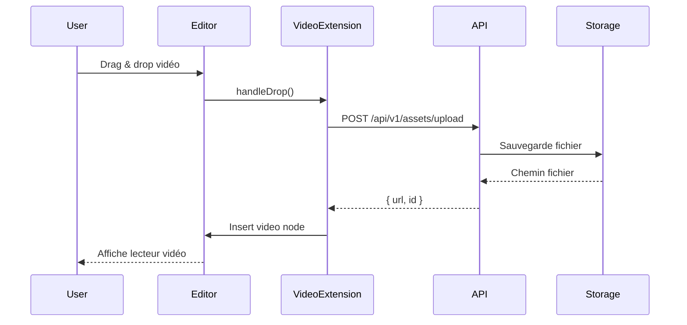

# Spécifications Techniques PlumeNote - Batch Multi-Fonctionnalités

> **Document généré le** : 24 décembre 2024  
> **Version** : 1.0  
> **Auteur** : Spécifications techniques pour Claude Code

---

## Table des matières

1. [FEAT-01 : Augmentation limite upload à 500 Mo](https://claude.ai/chat/b02383e3-a276-4e8b-a796-deb670a513e8#feat-01--augmentation-limite-upload-%C3%A0-500-mo)
2. [FEAT-02 : Support vidéo native dans les notes](https://claude.ai/chat/b02383e3-a276-4e8b-a796-deb670a513e8#feat-02--support-vid%C3%A9o-native-dans-les-notes)
3. [FEAT-03 : Tri alphanumérique automatique](https://claude.ai/chat/b02383e3-a276-4e8b-a796-deb670a513e8#feat-03--tri-alphanum%C3%A9rique-automatique)
4. [FEAT-04 : Drag & Drop des dossiers](https://claude.ai/chat/b02383e3-a276-4e8b-a796-deb670a513e8#feat-04--drag--drop-des-dossiers)
5. [FEAT-05 : Modale création note avec templates](https://claude.ai/chat/b02383e3-a276-4e8b-a796-deb670a513e8#feat-05--modale-cr%C3%A9ation-note-avec-templates)
6. [FEAT-06 : Console de gestion des templates](https://claude.ai/chat/b02383e3-a276-4e8b-a796-deb670a513e8#feat-06--console-de-gestion-des-templates)
7. [FEAT-07 : Rechercher/Remplacer dans l'éditeur](https://claude.ai/chat/b02383e3-a276-4e8b-a796-deb670a513e8#feat-07--rechercherremplacer-dans-l%C3%A9diteur)
8. [FEAT-08 : Factorisation composants espace général/personnel](https://claude.ai/chat/b02383e3-a276-4e8b-a796-deb670a513e8#feat-08--factorisation-composants-espace-g%C3%A9n%C3%A9ralpersonnel)
9. [FEAT-09 : Correction focus titre lors auto-save](https://claude.ai/chat/b02383e3-a276-4e8b-a796-deb670a513e8#feat-09--correction-focus-titre-lors-auto-save)
10. [FEAT-10 : Suppression des limites de rate limiting](https://claude.ai/chat/b02383e3-a276-4e8b-a796-deb670a513e8#feat-10--suppression-des-limites-de-rate-limiting)
11. [FEAT-11 : Correction scroll audit log](https://claude.ai/chat/b02383e3-a276-4e8b-a796-deb670a513e8#feat-11--correction-scroll-audit-log)
12. [FEAT-12 : Préférence vue édition/visualisation par utilisateur](https://claude.ai/chat/b02383e3-a276-4e8b-a796-deb670a513e8#feat-12--pr%C3%A9f%C3%A9rence-vue-%C3%A9ditionvisualisation-par-utilisateur)
13. [FEAT-13 : Nettoyage dossiers supprimés dans filtres recherche](https://claude.ai/chat/b02383e3-a276-4e8b-a796-deb670a513e8#feat-13--nettoyage-dossiers-supprim%C3%A9s-dans-filtres-recherche)

---

# FEAT-01 : Augmentation limite upload à 500 Mo

## 1. Résumé

|Attribut|Valeur|
|---|---|
|Type|Configuration|
|Priorité|P1-Haute|
|Complexité|S|
|Modules impactés|apps/api, docker/nginx|

### Description

Augmenter la limite d'upload de fichiers (images, documents, vidéos) de la valeur actuelle à 500 Mo pour permettre l'intégration de fichiers volumineux dans les notes.

### Critères d'acceptation

- [ ] Les fichiers jusqu'à 500 Mo peuvent être uploadés sans erreur
- [ ] La configuration Nginx autorise les requêtes de 500 Mo
- [ ] La configuration Fastify autorise les payloads de 500 Mo
- [ ] Le timeout est ajusté pour les uploads volumineux
- [ ] Un message d'erreur explicite s'affiche si la limite est dépassée

---

## 2. Analyse technique

### 2.1 Contexte actuel

La limite d'upload est définie à plusieurs niveaux :

- **Nginx** : `client_max_body_size` (probablement 10M ou moins)
- **Fastify** : `bodyLimit` dans la configuration du serveur
- **Multer/formidable** : limite dans la configuration d'upload

### 2.2 Solution proposée

Modifier les configurations à tous les niveaux pour autoriser 500 Mo (524288000 bytes).

---

## 3. Spécifications détaillées

### 3.1 Configuration Nginx

```nginx
# docker/nginx/nginx.conf

http {
    # Augmenter la limite de taille des requêtes à 500 Mo
    client_max_body_size 500M;
    
    # Augmenter les timeouts pour les uploads volumineux
    client_body_timeout 300s;
    proxy_read_timeout 300s;
    proxy_connect_timeout 300s;
    proxy_send_timeout 300s;
    
    # Buffer pour les gros uploads
    client_body_buffer_size 10M;
}
```

### 3.2 Configuration Fastify

```typescript
// apps/api/src/index.ts ou apps/api/src/server.ts

const app = Fastify({
  logger: true,
  // Limite à 500 Mo (en bytes)
  bodyLimit: 524288000, // 500 * 1024 * 1024
  // Ajuster les timeouts
  connectionTimeout: 300000, // 5 minutes
  keepAliveTimeout: 300000,
});
```

### 3.3 Configuration Multipart (si utilisé)

```typescript
// apps/api/src/plugins/multipart.ts

import fastifyMultipart from '@fastify/multipart';

app.register(fastifyMultipart, {
  limits: {
    fileSize: 524288000, // 500 Mo
    files: 10, // Nombre max de fichiers par requête
  },
});
```

### 3.4 Route attachments/assets

```typescript
// apps/api/src/routes/attachments.ts et assets.ts

// Vérifier que la route d'upload utilise la bonne configuration
app.post('/api/v1/attachments/upload', {
  preHandler: [app.authenticate],
  config: {
    // Timeout spécifique pour cette route
    timeout: 300000,
  },
  // ... rest of config
});
```

---

## 4. Fichiers à modifier

|Fichier|Modification|
|---|---|
|`docker/nginx/nginx.conf`|Ajouter `client_max_body_size 500M` et timeouts|
|`apps/api/src/index.ts`|Modifier `bodyLimit` à 524288000|
|`apps/api/src/plugins/multipart.ts`|Modifier `fileSize` limit|
|`apps/api/src/routes/attachments.ts`|Vérifier timeout config|
|`apps/api/src/routes/assets.ts`|Vérifier timeout config|

---

## 5. Notes pour Claude Code

### Commandes à exécuter

```bash
# Après modification, redémarrer les services
docker-compose down
docker-compose up -d

# Tester l'upload avec un fichier volumineux
curl -X POST -F "file=@large_file.mp4" http://localhost:3000/api/v1/assets/upload
```

### Points d'attention

- S'assurer que le système de fichiers a suffisamment d'espace disque
- Vérifier la configuration du stockage temporaire pour les uploads en cours

---

# FEAT-02 : Support vidéo native dans les notes

## 1. Résumé

|Attribut|Valeur|
|---|---|
|Type|Feature|
|Priorité|P1-Haute|
|Complexité|L|
|Modules impactés|apps/web, apps/api, packages/database|

### Description

Ajouter le support natif des vidéos dans l'éditeur TipTap, permettant d'intégrer des fichiers vidéo (MP4, WebM, etc.) directement dans les notes avec un lecteur intégré.

### Critères d'acceptation

- [ ] Upload de vidéos via drag & drop ou bouton
- [ ] Lecteur vidéo natif HTML5 intégré dans l'éditeur
- [ ] Support des formats MP4, WebM, OGG
- [ ] Contrôles de lecture (play, pause, volume, fullscreen)
- [ ] Prévisualisation avant insertion
- [ ] Redimensionnement du lecteur
- [ ] Export Markdown avec lien vers la vidéo
- [ ] Fonctionnel dans espace général ET personnel

---

## 2. Analyse technique

### 2.1 Contexte actuel

- L'extension Image existe déjà dans `apps/web/src/components/editor/extensions/`
- Le hook `useImageUpload` gère l'upload vers `/api/v1/assets`
- Les assets sont stockés avec le modèle `Asset` en base

### 2.2 Solution proposée

Créer une extension TipTap `Video` similaire à `Image`, avec :

- Node ProseMirror pour le rendu vidéo
- Hook `useVideoUpload` (réutilisant la logique de `useImageUpload`)
- Intégration dans le menu slash commands

### 2.3 Diagramme de séquence



---

## 3. Spécifications détaillées

### 3.1 Extension TipTap Video

```typescript
// apps/web/src/components/editor/extensions/video.ts

import { Node, mergeAttributes } from '@tiptap/core';
import { ReactNodeViewRenderer } from '@tiptap/react';
import { VideoComponent } from './VideoComponent';

export interface VideoOptions {
  HTMLAttributes: Record<string, unknown>;
  allowedMimeTypes: string[];
  maxFileSize: number;
}

declare module '@tiptap/core' {
  interface Commands<ReturnType> {
    video: {
      setVideo: (options: { src: string; title?: string }) => ReturnType;
    };
  }
}

export const Video = Node.create<VideoOptions>({
  name: 'video',
  
  group: 'block',
  
  atom: true,
  
  draggable: true,
  
  addOptions() {
    return {
      HTMLAttributes: {},
      allowedMimeTypes: ['video/mp4', 'video/webm', 'video/ogg'],
      maxFileSize: 524288000, // 500 Mo
    };
  },
  
  addAttributes() {
    return {
      src: {
        default: null,
      },
      title: {
        default: null,
      },
      width: {
        default: '100%',
      },
      height: {
        default: 'auto',
      },
      controls: {
        default: true,
      },
      assetId: {
        default: null,
      },
    };
  },
  
  parseHTML() {
    return [
      {
        tag: 'video',
      },
      {
        tag: 'div[data-video]',
      },
    ];
  },
  
  renderHTML({ HTMLAttributes }) {
    return ['video', mergeAttributes(this.options.HTMLAttributes, HTMLAttributes, {
      controls: true,
    })];
  },
  
  addCommands() {
    return {
      setVideo: (options) => ({ commands }) => {
        return commands.insertContent({
          type: this.name,
          attrs: options,
        });
      },
    };
  },
  
  addNodeView() {
    return ReactNodeViewRenderer(VideoComponent);
  },
});
```

### 3.2 Composant React VideoComponent

```typescript
// apps/web/src/components/editor/extensions/VideoComponent.tsx

import React, { useCallback, useState } from 'react';
import { NodeViewWrapper, NodeViewProps } from '@tiptap/react';
import { Play, Pause, Maximize2, Volume2, VolumeX, Trash2 } from 'lucide-react';
import { cn } from '@/lib/utils';

export function VideoComponent({ node, updateAttributes, deleteNode, selected }: NodeViewProps) {
  const { src, title, width, height } = node.attrs;
  const [isPlaying, setIsPlaying] = useState(false);
  const videoRef = React.useRef<HTMLVideoElement>(null);
  
  const handleResize = useCallback((newWidth: string) => {
    updateAttributes({ width: newWidth });
  }, [updateAttributes]);
  
  return (
    <NodeViewWrapper 
      className={cn(
        'video-wrapper relative group my-4',
        selected && 'ring-2 ring-primary ring-offset-2'
      )}
    >
      <div className="relative">
        <video
          ref={videoRef}
          src={src}
          title={title}
          controls
          className="w-full rounded-lg"
          style={{ width, height }}
          onPlay={() => setIsPlaying(true)}
          onPause={() => setIsPlaying(false)}
        >
          Votre navigateur ne supporte pas la lecture vidéo.
        </video>
        
        {/* Toolbar au survol */}
        <div className="absolute top-2 right-2 opacity-0 group-hover:opacity-100 transition-opacity flex gap-1">
          <button
            onClick={() => handleResize('50%')}
            className="p-1 bg-black/50 text-white rounded text-xs"
          >
            50%
          </button>
          <button
            onClick={() => handleResize('75%')}
            className="p-1 bg-black/50 text-white rounded text-xs"
          >
            75%
          </button>
          <button
            onClick={() => handleResize('100%')}
            className="p-1 bg-black/50 text-white rounded text-xs"
          >
            100%
          </button>
          <button
            onClick={deleteNode}
            className="p-1 bg-red-500/80 text-white rounded"
          >
            <Trash2 className="w-4 h-4" />
          </button>
        </div>
      </div>
      
      {title && (
        <p className="text-center text-sm text-muted-foreground mt-2">{title}</p>
      )}
    </NodeViewWrapper>
  );
}
```

### 3.3 Hook useVideoUpload

```typescript
// apps/web/src/hooks/useVideoUpload.ts

import { useCallback, useState } from 'react';
import { useMutation } from '@tanstack/react-query';
import { api } from '@/lib/api';
import { useAssetsStore } from '@/stores/assetsStore';
import { toast } from 'sonner';

interface UploadResult {
  id: string;
  url: string;
  filename: string;
  mimeType: string;
  size: number;
}

interface UseVideoUploadOptions {
  onSuccess?: (result: UploadResult) => void;
  onError?: (error: Error) => void;
  maxSize?: number; // en bytes, défaut 500 Mo
}

const ALLOWED_VIDEO_TYPES = ['video/mp4', 'video/webm', 'video/ogg', 'video/quicktime'];
const DEFAULT_MAX_SIZE = 524288000; // 500 Mo

export function useVideoUpload(options: UseVideoUploadOptions = {}) {
  const { onSuccess, onError, maxSize = DEFAULT_MAX_SIZE } = options;
  const [progress, setProgress] = useState(0);
  const { addAsset } = useAssetsStore();
  
  const uploadMutation = useMutation({
    mutationFn: async (file: File): Promise<UploadResult> => {
      // Validation
      if (!ALLOWED_VIDEO_TYPES.includes(file.type)) {
        throw new Error(`Type de fichier non supporté: ${file.type}. Formats acceptés: MP4, WebM, OGG`);
      }
      
      if (file.size > maxSize) {
        throw new Error(`Fichier trop volumineux (${(file.size / 1024 / 1024).toFixed(1)} Mo). Maximum: ${maxSize / 1024 / 1024} Mo`);
      }
      
      const formData = new FormData();
      formData.append('file', file);
      formData.append('type', 'video');
      
      const response = await api.post<{ success: boolean; data: UploadResult }>(
        '/assets/upload',
        formData,
        {
          headers: { 'Content-Type': 'multipart/form-data' },
          onUploadProgress: (progressEvent) => {
            if (progressEvent.total) {
              const percentCompleted = Math.round((progressEvent.loaded * 100) / progressEvent.total);
              setProgress(percentCompleted);
            }
          },
        }
      );
      
      if (!response.data.success) {
        throw new Error('Erreur lors de l\'upload');
      }
      
      return response.data.data;
    },
    onSuccess: (result) => {
      addAsset(result);
      setProgress(0);
      toast.success('Vidéo uploadée avec succès');
      onSuccess?.(result);
    },
    onError: (error: Error) => {
      setProgress(0);
      toast.error(error.message);
      onError?.(error);
    },
  });
  
  const upload = useCallback((file: File) => {
    return uploadMutation.mutateAsync(file);
  }, [uploadMutation]);
  
  const uploadFromUrl = useCallback(async (url: string, filename?: string) => {
    try {
      const response = await fetch(url);
      const blob = await response.blob();
      const file = new File([blob], filename || 'video.mp4', { type: blob.type });
      return upload(file);
    } catch (error) {
      toast.error('Impossible de récupérer la vidéo depuis l\'URL');
      throw error;
    }
  }, [upload]);
  
  return {
    upload,
    uploadFromUrl,
    isUploading: uploadMutation.isPending,
    progress,
    error: uploadMutation.error,
  };
}
```

### 3.4 Intégration dans l'éditeur

```typescript
// apps/web/src/components/editor/Editor.tsx (modification)

import { Video } from './extensions/video';

// Ajouter Video aux extensions
const extensions = [
  // ... autres extensions existantes
  Video.configure({
    allowedMimeTypes: ['video/mp4', 'video/webm', 'video/ogg'],
    maxFileSize: 524288000,
  }),
];
```

### 3.5 Slash Commands pour vidéo

```typescript
// apps/web/src/components/editor/menus/SlashCommands.tsx (modification)

// Ajouter dans la liste des commandes
{
  title: 'Vidéo',
  description: 'Insérer une vidéo',
  icon: <Video className="w-4 h-4" />,
  command: ({ editor, range }) => {
    // Ouvrir le sélecteur de fichier
    const input = document.createElement('input');
    input.type = 'file';
    input.accept = 'video/mp4,video/webm,video/ogg';
    input.onchange = async (e) => {
      const file = (e.target as HTMLInputElement).files?.[0];
      if (file) {
        // Upload et insertion géré par le hook
        // Voir implémentation dans le composant parent
      }
    };
    input.click();
  },
},
```

### 3.6 Export Markdown

```typescript
// apps/web/src/lib/markdownExport.ts (modification)

// Ajouter le handler pour les nœuds vidéo
function nodeToMarkdown(node: ProseMirrorNode): string {
  switch (node.type.name) {
    // ... autres cas
    case 'video':
      // Format: 
      // Ou format HTML pour compatibilité
      return `\n<video src="${node.attrs.src}" controls${node.attrs.title ? ` title="${node.attrs.title}"` : ''}></video>\n`;
  }
}
```

---

## 4. Fichiers à créer/modifier

|Fichier|Action|Description|
|---|---|---|
|`apps/web/src/components/editor/extensions/video.ts`|Créer|Extension TipTap Video|
|`apps/web/src/components/editor/extensions/VideoComponent.tsx`|Créer|Composant React du lecteur|
|`apps/web/src/hooks/useVideoUpload.ts`|Créer|Hook d'upload vidéo|
|`apps/web/src/components/editor/Editor.tsx`|Modifier|Ajouter extension Video|
|`apps/web/src/components/editor/menus/SlashCommands.tsx`|Modifier|Ajouter commande vidéo|
|`apps/web/src/components/editor/extensions/index.ts`|Modifier|Exporter Video|

---

## 5. Notes pour Claude Code

### Points d'attention

- Réutiliser la logique de `useImageUpload` pour le hook video
- S'assurer que le composant fonctionne en mode édition ET visualisation
- Tester le drag & drop de fichiers vidéo
- Vérifier la compatibilité avec la collaboration temps réel Yjs

---

# FEAT-03 : Tri alphanumérique automatique

## 1. Résumé

|Attribut|Valeur|
|---|---|
|Type|Improvement|
|Priorité|P2-Moyenne|
|Complexité|M|
|Modules impactés|apps/api, apps/web|

### Description

Les dossiers, sous-dossiers et notes doivent être automatiquement triés par ordre alphanumérique (natural sort pour gérer "Note 2" avant "Note 10").

### Critères d'acceptation

- [ ] Dossiers triés alphabétiquement dans la sidebar
- [ ] Sous-dossiers triés alphabétiquement dans leur parent
- [ ] Notes triées alphabétiquement dans leur dossier
- [ ] Natural sort (1, 2, 10 et non 1, 10, 2)
- [ ] Tri insensible à la casse
- [ ] Fonctionne pour espace général ET personnel

---

## 2. Analyse technique

### 2.1 Contexte actuel

- Les dossiers et notes utilisent un champ `position` pour l'ordre
- Le tri est probablement fait manuellement ou par date de création
- Les stores `useSidebarStore` et `useFoldersStore` gèrent l'affichage

### 2.2 Solution proposée

1. **Backend** : Modifier les routes pour retourner les données triées
2. **Frontend** : Ajouter une fonction de tri naturel appliquée à l'affichage
3. **Option** : Permettre à terme de choisir le mode de tri (alpha, date, manuel)

---

## 3. Spécifications détaillées

### 3.1 Fonction de tri naturel (utilitaire partagé)

```typescript
// packages/shared/src/utils/naturalSort.ts

/**
 * Comparateur pour tri alphanumérique naturel
 * Gère correctement "Note 2" < "Note 10"
 */
export function naturalCompare(a: string, b: string): number {
  const collator = new Intl.Collator(undefined, {
    numeric: true,
    sensitivity: 'base', // Insensible à la casse
  });
  return collator.compare(a, b);
}

/**
 * Trie un tableau d'objets par une propriété avec tri naturel
 */
export function naturalSortBy<T>(
  array: T[],
  key: keyof T | ((item: T) => string)
): T[] {
  const getKey = typeof key === 'function' ? key : (item: T) => String(item[key]);
  return [...array].sort((a, b) => naturalCompare(getKey(a), getKey(b)));
}
```

### 3.2 Modification Backend - Route folders

```typescript
// apps/api/src/routes/folders.ts

import { naturalCompare } from '@plumenote/shared/utils/naturalSort';

// GET /api/v1/folders - Liste des dossiers
app.get('/api/v1/folders', {
  preHandler: [app.authenticate],
}, async (request, reply) => {
  const folders = await prisma.folder.findMany({
    where: {
      // ... filtres existants
    },
    include: {
      children: true,
      notes: {
        where: { isDeleted: false },
        select: { id: true, title: true, slug: true },
      },
    },
  });
  
  // Tri récursif des dossiers et notes
  const sortedFolders = sortFoldersRecursively(folders);
  
  return { success: true, data: sortedFolders };
});

function sortFoldersRecursively(folders: Folder[]): Folder[] {
  return folders
    .sort((a, b) => naturalCompare(a.name, b.name))
    .map(folder => ({
      ...folder,
      children: folder.children ? sortFoldersRecursively(folder.children) : [],
      notes: folder.notes?.sort((a, b) => naturalCompare(a.title, b.title)) || [],
    }));
}
```

### 3.3 Modification Backend - Route notes

```typescript
// apps/api/src/routes/notes.ts

// GET /api/v1/notes?folderId=xxx
app.get('/api/v1/notes', {
  preHandler: [app.authenticate],
}, async (request, reply) => {
  const { folderId } = request.query as { folderId?: string };
  
  const notes = await prisma.note.findMany({
    where: {
      folderId,
      isDeleted: false,
    },
    orderBy: {
      title: 'asc', // Tri basique par la BDD
    },
  });
  
  // Tri naturel supplémentaire
  const sortedNotes = notes.sort((a, b) => naturalCompare(a.title, b.title));
  
  return { success: true, data: sortedNotes };
});
```

### 3.4 Modification Frontend - useSidebarStore

```typescript
// apps/web/src/stores/sidebarStore.ts

import { naturalSortBy } from '@plumenote/shared/utils/naturalSort';

// Dans le store, trier après chargement
interface SidebarState {
  folders: Folder[];
  // ...
}

export const useSidebarStore = create<SidebarState>((set, get) => ({
  folders: [],
  
  setFolders: (folders: Folder[]) => {
    // Trier les dossiers avant de les stocker
    const sortedFolders = sortFoldersRecursively(folders);
    set({ folders: sortedFolders });
  },
  
  // ...
}));

function sortFoldersRecursively(folders: Folder[]): Folder[] {
  return naturalSortBy(folders, 'name').map(folder => ({
    ...folder,
    children: folder.children ? sortFoldersRecursively(folder.children) : [],
    notes: folder.notes ? naturalSortBy(folder.notes, 'title') : [],
  }));
}
```

### 3.5 Modification Frontend - usePersonalStore

```typescript
// apps/web/src/stores/personalStore.ts

// Appliquer la même logique de tri pour l'espace personnel
import { naturalSortBy } from '@plumenote/shared/utils/naturalSort';

// Dans setFolders et setNotes, appliquer naturalSortBy
```

---

## 4. Fichiers à créer/modifier

|Fichier|Action|Description|
|---|---|---|
|`packages/shared/src/utils/naturalSort.ts`|Créer|Fonctions de tri naturel|
|`packages/shared/src/index.ts`|Modifier|Exporter naturalSort|
|`apps/api/src/routes/folders.ts`|Modifier|Tri côté serveur|
|`apps/api/src/routes/notes.ts`|Modifier|Tri côté serveur|
|`apps/api/src/routes/personal.ts`|Modifier|Tri espace personnel|
|`apps/web/src/stores/sidebarStore.ts`|Modifier|Tri côté client|
|`apps/web/src/stores/personalStore.ts`|Modifier|Tri côté client|

---

# FEAT-04 : Drag & Drop des dossiers

## 1. Résumé

|Attribut|Valeur|
|---|---|
|Type|Feature|
|Priorité|P2-Moyenne|
|Complexité|M|
|Modules impactés|apps/web, apps/api|

### Description

Permettre le drag & drop de dossiers et sous-dossiers vers d'autres dossiers, de manière similaire au drag & drop de notes déjà fonctionnel.

### Critères d'acceptation

- [ ] Drag & drop d'un dossier vers un autre dossier
- [ ] Drag & drop d'un dossier vers la racine
- [ ] Indicateur visuel pendant le drag
- [ ] Prévention des cycles (dossier dans lui-même ou ses enfants)
- [ ] Mise à jour instantanée sans refresh
- [ ] Fonctionne pour espace général ET personnel

---

## 2. Analyse technique

### 2.1 Contexte actuel

- Le composant `FolderTree` existe dans `apps/web/src/components/folders/`
- Le drag & drop de notes utilise probablement `@dnd-kit/core` ou HTML5 DnD
- La route `PATCH /api/v1/folders/:id` existe pour modifier un dossier

### 2.2 Solution proposée

Étendre le système de drag & drop existant pour gérer les dossiers avec :

- Validation anti-cycle côté frontend ET backend
- Mise à jour optimiste de l'UI

---

## 3. Spécifications détaillées

### 3.1 Backend - Route de déplacement

```typescript
// apps/api/src/routes/folders.ts

// PATCH /api/v1/folders/:id/move
const moveFolderSchema = z.object({
  targetParentId: z.string().uuid().nullable(), // null = racine
});

app.patch('/api/v1/folders/:id/move', {
  preHandler: [app.authenticate],
  schema: {
    params: z.object({ id: z.string().uuid() }),
    body: moveFolderSchema,
  },
}, async (request, reply) => {
  const { id } = request.params;
  const { targetParentId } = request.body;
  const userId = request.user.id;
  
  // Vérifier que le dossier existe
  const folder = await prisma.folder.findUnique({
    where: { id },
    include: { children: true },
  });
  
  if (!folder) {
    return reply.code(404).send({ success: false, error: { code: 'NOT_FOUND', message: 'Dossier non trouvé' } });
  }
  
  // Vérifier les permissions
  const hasPermission = await checkFolderPermission(userId, id, 'WRITE');
  if (!hasPermission) {
    return reply.code(403).send({ success: false, error: { code: 'FORBIDDEN', message: 'Permission refusée' } });
  }
  
  // Vérifier qu'on ne crée pas de cycle
  if (targetParentId) {
    const wouldCreateCycle = await checkForCycle(id, targetParentId);
    if (wouldCreateCycle) {
      return reply.code(400).send({
        success: false,
        error: { code: 'CYCLE_DETECTED', message: 'Impossible de déplacer un dossier dans lui-même ou ses sous-dossiers' }
      });
    }
  }
  
  // Mettre à jour le parentId
  const updatedFolder = await prisma.folder.update({
    where: { id },
    data: { parentId: targetParentId },
  });
  
  // Audit log
  await prisma.auditLog.create({
    data: {
      userId,
      action: 'FOLDER_MOVED',
      objectType: 'FOLDER',
      objectId: id,
      details: { from: folder.parentId, to: targetParentId },
    },
  });
  
  return { success: true, data: updatedFolder };
});

// Fonction de détection de cycle
async function checkForCycle(folderId: string, targetParentId: string): Promise<boolean> {
  // Si la cible est le dossier lui-même
  if (folderId === targetParentId) return true;
  
  // Remonter l'arbre depuis targetParentId
  let currentId: string | null = targetParentId;
  const visited = new Set<string>();
  
  while (currentId) {
    if (currentId === folderId) return true;
    if (visited.has(currentId)) break; // Protection contre boucle infinie
    visited.add(currentId);
    
    const parent = await prisma.folder.findUnique({
      where: { id: currentId },
      select: { parentId: true },
    });
    currentId = parent?.parentId || null;
  }
  
  return false;
}
```

### 3.2 Frontend - Composant FolderTreeItem draggable

```typescript
// apps/web/src/components/folders/FolderTreeItem.tsx

import { useDrag, useDrop } from 'react-dnd';
import { useMutation, useQueryClient } from '@tanstack/react-query';
import { api } from '@/lib/api';

interface FolderTreeItemProps {
  folder: Folder;
  level: number;
  onSelect: (folder: Folder) => void;
}

export function FolderTreeItem({ folder, level, onSelect }: FolderTreeItemProps) {
  const queryClient = useQueryClient();
  
  // Mutation pour déplacer un dossier
  const moveMutation = useMutation({
    mutationFn: async ({ folderId, targetParentId }: { folderId: string; targetParentId: string | null }) => {
      const response = await api.patch(`/folders/${folderId}/move`, { targetParentId });
      return response.data;
    },
    onSuccess: () => {
      queryClient.invalidateQueries({ queryKey: ['folders'] });
    },
  });
  
  // Configuration drag
  const [{ isDragging }, drag] = useDrag({
    type: 'FOLDER',
    item: { id: folder.id, parentId: folder.parentId },
    collect: (monitor) => ({
      isDragging: monitor.isDragging(),
    }),
  });
  
  // Configuration drop
  const [{ isOver, canDrop }, drop] = useDrop({
    accept: ['FOLDER', 'NOTE'],
    canDrop: (item: { id: string; parentId?: string }) => {
      // Empêcher de déposer sur soi-même
      if (item.id === folder.id) return false;
      // Empêcher de déposer dans un enfant (vérification basique côté frontend)
      // La vérification complète est faite côté backend
      return true;
    },
    drop: (item: { id: string }, monitor) => {
      if (!monitor.didDrop()) {
        if (monitor.getItemType() === 'FOLDER') {
          moveMutation.mutate({ folderId: item.id, targetParentId: folder.id });
        }
        // Note: le drop de notes est géré ailleurs
      }
    },
    collect: (monitor) => ({
      isOver: monitor.isOver({ shallow: true }),
      canDrop: monitor.canDrop(),
    }),
  });
  
  return (
    <div
      ref={(node) => drag(drop(node))}
      className={cn(
        'flex items-center gap-2 px-2 py-1 rounded cursor-pointer',
        isDragging && 'opacity-50',
        isOver && canDrop && 'bg-primary/20 ring-2 ring-primary',
        isOver && !canDrop && 'bg-destructive/20'
      )}
      style={{ paddingLeft: `${level * 16}px` }}
      onClick={() => onSelect(folder)}
    >
      <FolderIcon className="w-4 h-4" />
      <span>{folder.name}</span>
    </div>
  );
}
```

### 3.3 Store - Mise à jour optimiste

```typescript
// apps/web/src/stores/sidebarStore.ts (ajout)

moveFolder: (folderId: string, targetParentId: string | null) => {
  set((state) => {
    const folders = [...state.folders];
    // Trouver et retirer le dossier de son emplacement actuel
    const folderToMove = findAndRemoveFolder(folders, folderId);
    if (!folderToMove) return state;
    
    // Insérer dans le nouveau parent
    if (targetParentId === null) {
      folders.push({ ...folderToMove, parentId: null });
    } else {
      insertIntoParent(folders, targetParentId, folderToMove);
    }
    
    return { folders: sortFoldersRecursively(folders) };
  });
},
```

---

## 4. Fichiers à créer/modifier

|Fichier|Action|Description|
|---|---|---|
|`apps/api/src/routes/folders.ts`|Modifier|Ajouter route `/move`|
|`apps/web/src/components/folders/FolderTreeItem.tsx`|Modifier|Ajouter drag & drop|
|`apps/web/src/stores/sidebarStore.ts`|Modifier|Ajouter `moveFolder`|
|`apps/web/src/stores/personalStore.ts`|Modifier|Même logique pour espace perso|

---

# FEAT-05 : Modale création note avec templates

## 1. Résumé

|Attribut|Valeur|
|---|---|
|Type|Improvement|
|Priorité|P1-Haute|
|Complexité|M|
|Modules impactés|apps/web|

### Description

Afficher systématiquement une modale de création de note proposant les templates disponibles, plutôt que de créer une note vierge directement. Cette modale existe déjà (visible quand l'outil est vide) et doit devenir le comportement par défaut.

### Critères d'acceptation

- [ ] Clic sur "Nouvelle note" ouvre la modale avec templates
- [ ] Option "Note vierge" disponible en plus des templates
- [ ] Prévisualisation du template sélectionné
- [ ] Fonctionne pour espace général ET personnel
- [ ] Même composant utilisé partout (factorisation)

---

## 2. Analyse technique

### 2.1 Contexte actuel

- Une modale de création avec templates existe (visible à l'initialisation)
- Cette modale n'est pas réutilisée lors de la création classique
- Templates stockés en base avec le modèle `NoteTemplate`

### 2.2 Solution proposée

1. Identifier le composant modale existant
2. Le rendre paramétrable et réutilisable
3. L'appeler systématiquement lors de la création de note

---

## 3. Spécifications détaillées

### 3.1 Composant CreateNoteModal (refactorisé)

```typescript
// apps/web/src/components/notes/CreateNoteModal.tsx

import React, { useState } from 'react';
import { Dialog, DialogContent, DialogHeader, DialogTitle } from '@/components/ui/dialog';
import { Button } from '@/components/ui/button';
import { Input } from '@/components/ui/input';
import { useQuery, useMutation, useQueryClient } from '@tanstack/react-query';
import { api } from '@/lib/api';
import { FileText, FileCode, FileSpreadsheet, Calendar, Plus } from 'lucide-react';
import { cn } from '@/lib/utils';

interface Template {
  id: string;
  name: string;
  description: string | null;
  content: string;
  frontmatter: Record<string, unknown> | null;
  isBuiltIn: boolean;
  icon?: string;
}

interface CreateNoteModalProps {
  isOpen: boolean;
  onClose: () => void;
  folderId: string | null;
  isPersonal?: boolean; // Pour différencier espace général/personnel
  onNoteCreated?: (noteId: string) => void;
}

export function CreateNoteModal({ 
  isOpen, 
  onClose, 
  folderId, 
  isPersonal = false,
  onNoteCreated 
}: CreateNoteModalProps) {
  const [selectedTemplate, setSelectedTemplate] = useState<string | null>(null);
  const [noteTitle, setNoteTitle] = useState('');
  const queryClient = useQueryClient();
  
  // Charger les templates
  const { data: templates, isLoading } = useQuery({
    queryKey: ['templates'],
    queryFn: async () => {
      const response = await api.get<{ success: boolean; data: Template[] }>('/templates');
      return response.data.data;
    },
  });
  
  // Mutation création note
  const createMutation = useMutation({
    mutationFn: async ({ title, templateId }: { title: string; templateId: string | null }) => {
      const endpoint = isPersonal ? '/personal/notes' : '/notes';
      const response = await api.post(endpoint, {
        title: title || 'Sans titre',
        folderId,
        templateId,
      });
      return response.data;
    },
    onSuccess: (data) => {
      queryClient.invalidateQueries({ queryKey: isPersonal ? ['personal', 'notes'] : ['notes'] });
      queryClient.invalidateQueries({ queryKey: ['folders'] });
      onNoteCreated?.(data.data.id);
      handleClose();
    },
  });
  
  const handleClose = () => {
    setSelectedTemplate(null);
    setNoteTitle('');
    onClose();
  };
  
  const handleCreate = () => {
    createMutation.mutate({
      title: noteTitle,
      templateId: selectedTemplate,
    });
  };
  
  const getTemplateIcon = (template: Template) => {
    // Mapper les icônes selon le type de template
    switch (template.name.toLowerCase()) {
      case 'réunion':
      case 'meeting':
        return <Calendar className="w-8 h-8" />;
      case 'technique':
      case 'technical':
        return <FileCode className="w-8 h-8" />;
      case 'projet':
      case 'project':
        return <FileSpreadsheet className="w-8 h-8" />;
      default:
        return <FileText className="w-8 h-8" />;
    }
  };
  
  return (
    <Dialog open={isOpen} onOpenChange={(open) => !open && handleClose()}>
      <DialogContent className="max-w-2xl">
        <DialogHeader>
          <DialogTitle>Créer une nouvelle note</DialogTitle>
        </DialogHeader>
        
        <div className="space-y-4">
          {/* Titre de la note */}
          <div>
            <label className="text-sm font-medium">Titre de la note</label>
            <Input
              value={noteTitle}
              onChange={(e) => setNoteTitle(e.target.value)}
              placeholder="Entrez un titre..."
              autoFocus
            />
          </div>
          
          {/* Sélection du template */}
          <div>
            <label className="text-sm font-medium mb-2 block">
              Choisir un template (optionnel)
            </label>
            
            <div className="grid grid-cols-2 md:grid-cols-3 gap-3">
              {/* Option note vierge */}
              <button
                onClick={() => setSelectedTemplate(null)}
                className={cn(
                  'flex flex-col items-center gap-2 p-4 rounded-lg border-2 transition-all',
                  selectedTemplate === null
                    ? 'border-primary bg-primary/10'
                    : 'border-border hover:border-primary/50'
                )}
              >
                <Plus className="w-8 h-8 text-muted-foreground" />
                <span className="font-medium">Note vierge</span>
                <span className="text-xs text-muted-foreground">Commencer de zéro</span>
              </button>
              
              {/* Templates disponibles */}
              {templates?.map((template) => (
                <button
                  key={template.id}
                  onClick={() => setSelectedTemplate(template.id)}
                  className={cn(
                    'flex flex-col items-center gap-2 p-4 rounded-lg border-2 transition-all',
                    selectedTemplate === template.id
                      ? 'border-primary bg-primary/10'
                      : 'border-border hover:border-primary/50'
                  )}
                >
                  {getTemplateIcon(template)}
                  <span className="font-medium">{template.name}</span>
                  {template.description && (
                    <span className="text-xs text-muted-foreground text-center line-clamp-2">
                      {template.description}
                    </span>
                  )}
                </button>
              ))}
            </div>
          </div>
          
          {/* Prévisualisation */}
          {selectedTemplate && (
            <div className="border rounded-lg p-4 bg-muted/50 max-h-40 overflow-auto">
              <p className="text-sm text-muted-foreground mb-2">Aperçu :</p>
              <pre className="text-xs whitespace-pre-wrap">
                {templates?.find(t => t.id === selectedTemplate)?.content?.slice(0, 500)}
                {(templates?.find(t => t.id === selectedTemplate)?.content?.length || 0) > 500 && '...'}
              </pre>
            </div>
          )}
        </div>
        
        {/* Actions */}
        <div className="flex justify-end gap-2 mt-4">
          <Button variant="outline" onClick={handleClose}>
            Annuler
          </Button>
          <Button 
            onClick={handleCreate}
            disabled={createMutation.isPending}
          >
            {createMutation.isPending ? 'Création...' : 'Créer la note'}
          </Button>
        </div>
      </DialogContent>
    </Dialog>
  );
}
```

### 3.2 Modification du hook/store de création

```typescript
// apps/web/src/stores/notesStore.ts (ou équivalent)

interface NotesState {
  // ...
  isCreateModalOpen: boolean;
  createModalFolderId: string | null;
  openCreateModal: (folderId: string | null) => void;
  closeCreateModal: () => void;
}

// Utiliser ce state pour contrôler la modale
openCreateModal: (folderId) => set({ isCreateModalOpen: true, createModalFolderId: folderId }),
closeCreateModal: () => set({ isCreateModalOpen: false, createModalFolderId: null }),
```

### 3.3 Intégration dans les boutons de création

```typescript
// Partout où il y a un bouton "Nouvelle note"

import { useNotesStore } from '@/stores/notesStore';
import { CreateNoteModal } from '@/components/notes/CreateNoteModal';

function SomeComponent() {
  const { openCreateModal, isCreateModalOpen, closeCreateModal, createModalFolderId } = useNotesStore();
  
  return (
    <>
      <Button onClick={() => openCreateModal(currentFolderId)}>
        <Plus className="w-4 h-4 mr-2" />
        Nouvelle note
      </Button>
      
      <CreateNoteModal
        isOpen={isCreateModalOpen}
        onClose={closeCreateModal}
        folderId={createModalFolderId}
      />
    </>
  );
}
```

---

## 4. Fichiers à créer/modifier

|Fichier|Action|Description|
|---|---|---|
|`apps/web/src/components/notes/CreateNoteModal.tsx`|Créer/Refactoriser|Modale unifiée|
|`apps/web/src/stores/notesStore.ts`|Modifier|Ajouter état modale|
|`apps/web/src/components/sidebar/SidebarActions.tsx`|Modifier|Utiliser la modale|
|`apps/web/src/components/folders/FolderHeader.tsx`|Modifier|Utiliser la modale|
|`apps/web/src/pages/PersonalHomePage.tsx`|Modifier|Utiliser la modale|

---

# FEAT-06 : Console de gestion des templates

## 1. Résumé

|Attribut|Valeur|
|---|---|
|Type|Feature|
|Priorité|P2-Moyenne|
|Complexité|L|
|Modules impactés|apps/web, apps/api|

### Description

Interface d'administration permettant de créer, modifier, supprimer et gérer les templates de notes. Accessible depuis les paramètres ou l'administration.

### Critères d'acceptation

- [ ] Liste des templates existants avec prévisualisation
- [ ] Création de nouveaux templates
- [ ] Modification de templates existants (sauf built-in)
- [ ] Suppression de templates (sauf built-in)
- [ ] Éditeur Markdown pour le contenu du template
- [ ] Gestion du frontmatter par défaut
- [ ] Indication des templates système (non modifiables)

---

## 2. Analyse technique

### 2.1 Contexte actuel

- Modèle `NoteTemplate` existant avec `isBuiltIn` pour les templates système
- Route `/api/v1/templates` existe probablement en lecture
- Pas d'interface d'administration existante

### 2.2 Solution proposée

1. Créer les routes CRUD complètes pour les templates
2. Créer une page/section de gestion dans Settings ou Admin
3. Utiliser l'éditeur TipTap en mode simplifié pour l'édition

---

## 3. Spécifications détaillées

### 3.1 Routes API

```typescript
// apps/api/src/routes/templates.ts

import { FastifyInstance } from 'fastify';
import { z } from 'zod';
import { prisma } from '@plumenote/database';

const templateSchema = z.object({
  name: z.string().min(1).max(100),
  description: z.string().max(500).optional(),
  content: z.string(),
  frontmatter: z.record(z.unknown()).optional(),
});

export async function templateRoutes(app: FastifyInstance) {
  // GET /api/v1/templates - Liste tous les templates
  app.get('/api/v1/templates', {
    preHandler: [app.authenticate],
  }, async (request, reply) => {
    const templates = await prisma.noteTemplate.findMany({
      orderBy: [
        { isBuiltIn: 'desc' }, // Built-in en premier
        { name: 'asc' },
      ],
    });
    return { success: true, data: templates };
  });
  
  // GET /api/v1/templates/:id
  app.get('/api/v1/templates/:id', {
    preHandler: [app.authenticate],
  }, async (request, reply) => {
    const { id } = request.params as { id: string };
    const template = await prisma.noteTemplate.findUnique({ where: { id } });
    
    if (!template) {
      return reply.code(404).send({ success: false, error: { code: 'NOT_FOUND' } });
    }
    
    return { success: true, data: template };
  });
  
  // POST /api/v1/templates - Créer un template
  app.post('/api/v1/templates', {
    preHandler: [app.authenticate, app.requireRole(['ADMIN', 'EDITOR'])],
    schema: { body: templateSchema },
  }, async (request, reply) => {
    const data = request.body as z.infer<typeof templateSchema>;
    
    const template = await prisma.noteTemplate.create({
      data: {
        ...data,
        isBuiltIn: false, // Les templates créés par l'utilisateur ne sont jamais built-in
      },
    });
    
    await prisma.auditLog.create({
      data: {
        userId: request.user.id,
        action: 'TEMPLATE_CREATED',
        objectType: 'TEMPLATE',
        objectId: template.id,
        details: { name: template.name },
      },
    });
    
    return { success: true, data: template };
  });
  
  // PATCH /api/v1/templates/:id - Modifier un template
  app.patch('/api/v1/templates/:id', {
    preHandler: [app.authenticate, app.requireRole(['ADMIN', 'EDITOR'])],
    schema: { body: templateSchema.partial() },
  }, async (request, reply) => {
    const { id } = request.params as { id: string };
    const data = request.body as Partial<z.infer<typeof templateSchema>>;
    
    // Vérifier que le template existe et n'est pas built-in
    const existing = await prisma.noteTemplate.findUnique({ where: { id } });
    if (!existing) {
      return reply.code(404).send({ success: false, error: { code: 'NOT_FOUND' } });
    }
    if (existing.isBuiltIn) {
      return reply.code(403).send({ 
        success: false, 
        error: { code: 'FORBIDDEN', message: 'Les templates système ne peuvent pas être modifiés' } 
      });
    }
    
    const template = await prisma.noteTemplate.update({
      where: { id },
      data,
    });
    
    await prisma.auditLog.create({
      data: {
        userId: request.user.id,
        action: 'TEMPLATE_UPDATED',
        objectType: 'TEMPLATE',
        objectId: template.id,
        details: data,
      },
    });
    
    return { success: true, data: template };
  });
  
  // DELETE /api/v1/templates/:id
  app.delete('/api/v1/templates/:id', {
    preHandler: [app.authenticate, app.requireRole(['ADMIN'])],
  }, async (request, reply) => {
    const { id } = request.params as { id: string };
    
    const existing = await prisma.noteTemplate.findUnique({ where: { id } });
    if (!existing) {
      return reply.code(404).send({ success: false, error: { code: 'NOT_FOUND' } });
    }
    if (existing.isBuiltIn) {
      return reply.code(403).send({ 
        success: false, 
        error: { code: 'FORBIDDEN', message: 'Les templates système ne peuvent pas être supprimés' } 
      });
    }
    
    await prisma.noteTemplate.delete({ where: { id } });
    
    await prisma.auditLog.create({
      data: {
        userId: request.user.id,
        action: 'TEMPLATE_DELETED',
        objectType: 'TEMPLATE',
        objectId: id,
        details: { name: existing.name },
      },
    });
    
    return { success: true };
  });
}
```

### 3.2 Composant TemplatesManager

```typescript
// apps/web/src/components/templates/TemplatesManager.tsx

import React, { useState } from 'react';
import { useQuery, useMutation, useQueryClient } from '@tanstack/react-query';
import { api } from '@/lib/api';
import { 
  Table, TableBody, TableCell, TableHead, TableHeader, TableRow 
} from '@/components/ui/table';
import { Button } from '@/components/ui/button';
import { Badge } from '@/components/ui/badge';
import { 
  Dialog, DialogContent, DialogHeader, DialogTitle, DialogFooter 
} from '@/components/ui/dialog';
import { Input } from '@/components/ui/input';
import { Textarea } from '@/components/ui/textarea';
import { Pencil, Trash2, Plus, Lock, Eye } from 'lucide-react';
import { toast } from 'sonner';

interface Template {
  id: string;
  name: string;
  description: string | null;
  content: string;
  frontmatter: Record<string, unknown> | null;
  isBuiltIn: boolean;
  createdAt: string;
  updatedAt: string;
}

export function TemplatesManager() {
  const queryClient = useQueryClient();
  const [editingTemplate, setEditingTemplate] = useState<Template | null>(null);
  const [isCreating, setIsCreating] = useState(false);
  const [previewTemplate, setPreviewTemplate] = useState<Template | null>(null);
  
  // Formulaire
  const [formData, setFormData] = useState({
    name: '',
    description: '',
    content: '',
    frontmatter: '{}',
  });
  
  // Charger les templates
  const { data: templates, isLoading } = useQuery({
    queryKey: ['templates'],
    queryFn: async () => {
      const response = await api.get<{ success: boolean; data: Template[] }>('/templates');
      return response.data.data;
    },
  });
  
  // Mutations
  const createMutation = useMutation({
    mutationFn: async (data: typeof formData) => {
      const response = await api.post('/templates', {
        ...data,
        frontmatter: JSON.parse(data.frontmatter || '{}'),
      });
      return response.data;
    },
    onSuccess: () => {
      queryClient.invalidateQueries({ queryKey: ['templates'] });
      toast.success('Template créé');
      closeModal();
    },
    onError: () => toast.error('Erreur lors de la création'),
  });
  
  const updateMutation = useMutation({
    mutationFn: async ({ id, data }: { id: string; data: typeof formData }) => {
      const response = await api.patch(`/templates/${id}`, {
        ...data,
        frontmatter: JSON.parse(data.frontmatter || '{}'),
      });
      return response.data;
    },
    onSuccess: () => {
      queryClient.invalidateQueries({ queryKey: ['templates'] });
      toast.success('Template modifié');
      closeModal();
    },
    onError: () => toast.error('Erreur lors de la modification'),
  });
  
  const deleteMutation = useMutation({
    mutationFn: async (id: string) => {
      await api.delete(`/templates/${id}`);
    },
    onSuccess: () => {
      queryClient.invalidateQueries({ queryKey: ['templates'] });
      toast.success('Template supprimé');
    },
    onError: () => toast.error('Erreur lors de la suppression'),
  });
  
  const openCreate = () => {
    setFormData({ name: '', description: '', content: '', frontmatter: '{}' });
    setIsCreating(true);
  };
  
  const openEdit = (template: Template) => {
    setFormData({
      name: template.name,
      description: template.description || '',
      content: template.content,
      frontmatter: JSON.stringify(template.frontmatter || {}, null, 2),
    });
    setEditingTemplate(template);
  };
  
  const closeModal = () => {
    setIsCreating(false);
    setEditingTemplate(null);
    setFormData({ name: '', description: '', content: '', frontmatter: '{}' });
  };
  
  const handleSubmit = () => {
    if (editingTemplate) {
      updateMutation.mutate({ id: editingTemplate.id, data: formData });
    } else {
      createMutation.mutate(formData);
    }
  };
  
  const handleDelete = (template: Template) => {
    if (confirm(`Supprimer le template "${template.name}" ?`)) {
      deleteMutation.mutate(template.id);
    }
  };
  
  return (
    <div className="space-y-4">
      <div className="flex justify-between items-center">
        <h2 className="text-xl font-semibold">Gestion des templates</h2>
        <Button onClick={openCreate}>
          <Plus className="w-4 h-4 mr-2" />
          Nouveau template
        </Button>
      </div>
      
      <Table>
        <TableHeader>
          <TableRow>
            <TableHead>Nom</TableHead>
            <TableHead>Description</TableHead>
            <TableHead>Type</TableHead>
            <TableHead className="text-right">Actions</TableHead>
          </TableRow>
        </TableHeader>
        <TableBody>
          {templates?.map((template) => (
            <TableRow key={template.id}>
              <TableCell className="font-medium">{template.name}</TableCell>
              <TableCell className="text-muted-foreground">
                {template.description || '-'}
              </TableCell>
              <TableCell>
                {template.isBuiltIn ? (
                  <Badge variant="secondary">
                    <Lock className="w-3 h-3 mr-1" />
                    Système
                  </Badge>
                ) : (
                  <Badge variant="outline">Personnalisé</Badge>
                )}
              </TableCell>
              <TableCell className="text-right">
                <div className="flex justify-end gap-2">
                  <Button
                    variant="ghost"
                    size="icon"
                    onClick={() => setPreviewTemplate(template)}
                  >
                    <Eye className="w-4 h-4" />
                  </Button>
                  {!template.isBuiltIn && (
                    <>
                      <Button
                        variant="ghost"
                        size="icon"
                        onClick={() => openEdit(template)}
                      >
                        <Pencil className="w-4 h-4" />
                      </Button>
                      <Button
                        variant="ghost"
                        size="icon"
                        onClick={() => handleDelete(template)}
                      >
                        <Trash2 className="w-4 h-4 text-destructive" />
                      </Button>
                    </>
                  )}
                </div>
              </TableCell>
            </TableRow>
          ))}
        </TableBody>
      </Table>
      
      {/* Modal création/édition */}
      <Dialog open={isCreating || !!editingTemplate} onOpenChange={() => closeModal()}>
        <DialogContent className="max-w-2xl max-h-[80vh] overflow-y-auto">
          <DialogHeader>
            <DialogTitle>
              {editingTemplate ? 'Modifier le template' : 'Créer un template'}
            </DialogTitle>
          </DialogHeader>
          
          <div className="space-y-4">
            <div>
              <label className="text-sm font-medium">Nom *</label>
              <Input
                value={formData.name}
                onChange={(e) => setFormData(prev => ({ ...prev, name: e.target.value }))}
                placeholder="Ex: Compte-rendu réunion"
              />
            </div>
            
            <div>
              <label className="text-sm font-medium">Description</label>
              <Input
                value={formData.description}
                onChange={(e) => setFormData(prev => ({ ...prev, description: e.target.value }))}
                placeholder="Description courte du template"
              />
            </div>
            
            <div>
              <label className="text-sm font-medium">Contenu (Markdown)</label>
              <Textarea
                value={formData.content}
                onChange={(e) => setFormData(prev => ({ ...prev, content: e.target.value }))}
                placeholder="# Titre&#10;&#10;## Section 1&#10;..."
                rows={12}
                className="font-mono text-sm"
              />
            </div>
            
            <div>
              <label className="text-sm font-medium">Frontmatter par défaut (JSON)</label>
              <Textarea
                value={formData.frontmatter}
                onChange={(e) => setFormData(prev => ({ ...prev, frontmatter: e.target.value }))}
                placeholder='{ "tags": [], "status": "draft" }'
                rows={4}
                className="font-mono text-sm"
              />
            </div>
          </div>
          
          <DialogFooter>
            <Button variant="outline" onClick={closeModal}>
              Annuler
            </Button>
            <Button 
              onClick={handleSubmit}
              disabled={!formData.name || createMutation.isPending || updateMutation.isPending}
            >
              {editingTemplate ? 'Enregistrer' : 'Créer'}
            </Button>
          </DialogFooter>
        </DialogContent>
      </Dialog>
      
      {/* Modal prévisualisation */}
      <Dialog open={!!previewTemplate} onOpenChange={() => setPreviewTemplate(null)}>
        <DialogContent className="max-w-2xl max-h-[80vh] overflow-y-auto">
          <DialogHeader>
            <DialogTitle>Aperçu : {previewTemplate?.name}</DialogTitle>
          </DialogHeader>
          <div className="prose prose-sm max-w-none">
            <pre className="whitespace-pre-wrap bg-muted p-4 rounded">
              {previewTemplate?.content}
            </pre>
          </div>
        </DialogContent>
      </Dialog>
    </div>
  );
}
```

### 3.3 Intégration dans les paramètres

```typescript
// apps/web/src/pages/SettingsPage.tsx ou AdminPage.tsx

import { TemplatesManager } from '@/components/templates/TemplatesManager';

// Dans les tabs/sections de la page
<TabsContent value="templates">
  <TemplatesManager />
</TabsContent>
```

---

## 4. Fichiers à créer/modifier

|Fichier|Action|Description|
|---|---|---|
|`apps/api/src/routes/templates.ts`|Modifier|Ajouter CRUD complet|
|`apps/web/src/components/templates/TemplatesManager.tsx`|Créer|Interface de gestion|
|`apps/web/src/pages/SettingsPage.tsx`|Modifier|Ajouter section templates|

---

# FEAT-07 : Rechercher/Remplacer dans l'éditeur

## 1. Résumé

|Attribut|Valeur|
|---|---|
|Type|Feature|
|Priorité|P2-Moyenne|
|Complexité|M|
|Modules impactés|apps/web|

### Description

Implémenter la fonctionnalité Rechercher/Remplacer (Ctrl+H ou similaire) dans l'éditeur TipTap pour permettre la recherche et le remplacement de texte dans la note courante.

### Critères d'acceptation

- [ ] Raccourci clavier pour ouvrir la barre de recherche (Ctrl+F ou Ctrl+H)
- [ ] Champ de recherche avec surlignage des occurrences
- [ ] Navigation entre les occurrences (suivant/précédent)
- [ ] Option de remplacement (remplacer / remplacer tout)
- [ ] Options : sensible à la casse, mot entier, regex
- [ ] Compteur d'occurrences
- [ ] Fermeture avec Échap

---

## 2. Analyse technique

### 2.1 Contexte actuel

TipTap/ProseMirror n'inclut pas de recherche native. Il existe des extensions communautaires comme `@tiptap-pro/extension-search-and-replace` ou des implémentations custom.

### 2.2 Solution proposée

Implémenter une extension custom de recherche/remplacement :

1. Extension TipTap pour la logique de recherche
2. Composant UI pour l'interface de recherche
3. Décorateurs pour le surlignage

---

## 3. Spécifications détaillées

### 3.1 Extension SearchAndReplace

```typescript
// apps/web/src/components/editor/extensions/searchReplace.ts

import { Extension } from '@tiptap/core';
import { Decoration, DecorationSet } from '@tiptap/pm/view';
import { Plugin, PluginKey } from '@tiptap/pm/state';
import { Node as ProseMirrorNode } from '@tiptap/pm/model';

export interface SearchReplaceOptions {
  searchTerm: string;
  replaceTerm: string;
  caseSensitive: boolean;
  wholeWord: boolean;
  useRegex: boolean;
}

export interface SearchReplaceStorage {
  results: { from: number; to: number }[];
  currentIndex: number;
}

declare module '@tiptap/core' {
  interface Commands<ReturnType> {
    searchReplace: {
      setSearchTerm: (term: string) => ReturnType;
      setReplaceTerm: (term: string) => ReturnType;
      setCaseSensitive: (value: boolean) => ReturnType;
      setWholeWord: (value: boolean) => ReturnType;
      setUseRegex: (value: boolean) => ReturnType;
      goToNextResult: () => ReturnType;
      goToPrevResult: () => ReturnType;
      replace: () => ReturnType;
      replaceAll: () => ReturnType;
      clearSearch: () => ReturnType;
    };
  }
}

export const searchReplacePluginKey = new PluginKey('searchReplace');

export const SearchReplace = Extension.create<SearchReplaceOptions, SearchReplaceStorage>({
  name: 'searchReplace',
  
  addOptions() {
    return {
      searchTerm: '',
      replaceTerm: '',
      caseSensitive: false,
      wholeWord: false,
      useRegex: false,
    };
  },
  
  addStorage() {
    return {
      results: [],
      currentIndex: -1,
    };
  },
  
  addCommands() {
    return {
      setSearchTerm: (term: string) => ({ editor }) => {
        this.options.searchTerm = term;
        this.storage.results = this.findResults(editor.state.doc, term);
        this.storage.currentIndex = this.storage.results.length > 0 ? 0 : -1;
        return true;
      },
      
      setReplaceTerm: (term: string) => () => {
        this.options.replaceTerm = term;
        return true;
      },
      
      setCaseSensitive: (value: boolean) => ({ editor }) => {
        this.options.caseSensitive = value;
        if (this.options.searchTerm) {
          this.storage.results = this.findResults(editor.state.doc, this.options.searchTerm);
        }
        return true;
      },
      
      setWholeWord: (value: boolean) => ({ editor }) => {
        this.options.wholeWord = value;
        if (this.options.searchTerm) {
          this.storage.results = this.findResults(editor.state.doc, this.options.searchTerm);
        }
        return true;
      },
      
      setUseRegex: (value: boolean) => ({ editor }) => {
        this.options.useRegex = value;
        if (this.options.searchTerm) {
          this.storage.results = this.findResults(editor.state.doc, this.options.searchTerm);
        }
        return true;
      },
      
      goToNextResult: () => ({ editor }) => {
        if (this.storage.results.length === 0) return false;
        this.storage.currentIndex = (this.storage.currentIndex + 1) % this.storage.results.length;
        const result = this.storage.results[this.storage.currentIndex];
        editor.commands.setTextSelection({ from: result.from, to: result.to });
        return true;
      },
      
      goToPrevResult: () => ({ editor }) => {
        if (this.storage.results.length === 0) return false;
        this.storage.currentIndex = (this.storage.currentIndex - 1 + this.storage.results.length) % this.storage.results.length;
        const result = this.storage.results[this.storage.currentIndex];
        editor.commands.setTextSelection({ from: result.from, to: result.to });
        return true;
      },
      
      replace: () => ({ editor, tr, dispatch }) => {
        if (this.storage.currentIndex === -1 || !this.options.replaceTerm) return false;
        const result = this.storage.results[this.storage.currentIndex];
        if (dispatch) {
          tr.insertText(this.options.replaceTerm, result.from, result.to);
          dispatch(tr);
        }
        // Mettre à jour les résultats après remplacement
        this.storage.results = this.findResults(editor.state.doc, this.options.searchTerm);
        return true;
      },
      
      replaceAll: () => ({ editor, tr, dispatch }) => {
        if (this.storage.results.length === 0 || !this.options.replaceTerm) return false;
        // Remplacer de la fin vers le début pour préserver les positions
        const sortedResults = [...this.storage.results].sort((a, b) => b.from - a.from);
        if (dispatch) {
          for (const result of sortedResults) {
            tr.insertText(this.options.replaceTerm, result.from, result.to);
          }
          dispatch(tr);
        }
        this.storage.results = [];
        this.storage.currentIndex = -1;
        return true;
      },
      
      clearSearch: () => () => {
        this.options.searchTerm = '';
        this.options.replaceTerm = '';
        this.storage.results = [];
        this.storage.currentIndex = -1;
        return true;
      },
    };
  },
  
  addProseMirrorPlugins() {
    const extension = this;
    
    return [
      new Plugin({
        key: searchReplacePluginKey,
        state: {
          init() {
            return DecorationSet.empty;
          },
          apply(tr, oldState) {
            // Recalculer les décorations si le document change
            return extension.createDecorations(tr.doc);
          },
        },
        props: {
          decorations(state) {
            return this.getState(state);
          },
        },
      }),
    ];
  },
  
  addKeyboardShortcuts() {
    return {
      'Mod-f': () => {
        // Émettre un événement pour ouvrir la UI de recherche
        this.editor.emit('openSearch', {});
        return true;
      },
      'Mod-h': () => {
        this.editor.emit('openSearchReplace', {});
        return true;
      },
      'Escape': () => {
        this.editor.commands.clearSearch();
        this.editor.emit('closeSearch', {});
        return true;
      },
    };
  },
  
  // Méthodes utilitaires
  findResults(doc: ProseMirrorNode, searchTerm: string): { from: number; to: number }[] {
    if (!searchTerm) return [];
    
    const results: { from: number; to: number }[] = [];
    let regex: RegExp;
    
    try {
      if (this.options.useRegex) {
        regex = new RegExp(searchTerm, this.options.caseSensitive ? 'g' : 'gi');
      } else {
        const escaped = searchTerm.replace(/[.*+?^${}()|[\]\\]/g, '\\$&');
        const pattern = this.options.wholeWord ? `\\b${escaped}\\b` : escaped;
        regex = new RegExp(pattern, this.options.caseSensitive ? 'g' : 'gi');
      }
    } catch {
      return []; // Regex invalide
    }
    
    doc.descendants((node, pos) => {
      if (node.isText && node.text) {
        let match;
        while ((match = regex.exec(node.text)) !== null) {
          results.push({
            from: pos + match.index,
            to: pos + match.index + match[0].length,
          });
        }
      }
    });
    
    return results;
  },
  
  createDecorations(doc: ProseMirrorNode): DecorationSet {
    const decorations: Decoration[] = [];
    
    this.storage.results.forEach((result, index) => {
      const className = index === this.storage.currentIndex 
        ? 'search-result search-result-current' 
        : 'search-result';
      
      decorations.push(
        Decoration.inline(result.from, result.to, { class: className })
      );
    });
    
    return DecorationSet.create(doc, decorations);
  },
});
```

### 3.2 Composant UI SearchBar

```typescript
// apps/web/src/components/editor/SearchBar.tsx

import React, { useState, useEffect, useCallback, useRef } from 'react';
import { Editor } from '@tiptap/react';
import { Input } from '@/components/ui/input';
import { Button } from '@/components/ui/button';
import { Checkbox } from '@/components/ui/checkbox';
import { 
  ChevronUp, ChevronDown, X, Replace, ReplaceAll,
  CaseSensitive, WholeWord, Regex
} from 'lucide-react';
import { cn } from '@/lib/utils';

interface SearchBarProps {
  editor: Editor;
  isOpen: boolean;
  showReplace?: boolean;
  onClose: () => void;
}

export function SearchBar({ editor, isOpen, showReplace = false, onClose }: SearchBarProps) {
  const [searchTerm, setSearchTerm] = useState('');
  const [replaceTerm, setReplaceTerm] = useState('');
  const [caseSensitive, setCaseSensitive] = useState(false);
  const [wholeWord, setWholeWord] = useState(false);
  const [useRegex, setUseRegex] = useState(false);
  const [replaceVisible, setReplaceVisible] = useState(showReplace);
  
  const searchInputRef = useRef<HTMLInputElement>(null);
  
  // Focus sur l'input quand la barre s'ouvre
  useEffect(() => {
    if (isOpen) {
      searchInputRef.current?.focus();
      searchInputRef.current?.select();
    }
  }, [isOpen]);
  
  // Sync avec l'extension
  useEffect(() => {
    editor.commands.setSearchTerm(searchTerm);
  }, [searchTerm, editor]);
  
  useEffect(() => {
    editor.commands.setReplaceTerm(replaceTerm);
  }, [replaceTerm, editor]);
  
  useEffect(() => {
    editor.commands.setCaseSensitive(caseSensitive);
  }, [caseSensitive, editor]);
  
  useEffect(() => {
    editor.commands.setWholeWord(wholeWord);
  }, [wholeWord, editor]);
  
  useEffect(() => {
    editor.commands.setUseRegex(useRegex);
  }, [useRegex, editor]);
  
  const storage = editor.storage.searchReplace;
  const resultCount = storage?.results?.length || 0;
  const currentIndex = storage?.currentIndex ?? -1;
  
  const handleClose = useCallback(() => {
    editor.commands.clearSearch();
    setSearchTerm('');
    setReplaceTerm('');
    onClose();
  }, [editor, onClose]);
  
  const handleKeyDown = (e: React.KeyboardEvent) => {
    if (e.key === 'Escape') {
      handleClose();
    } else if (e.key === 'Enter') {
      if (e.shiftKey) {
        editor.commands.goToPrevResult();
      } else {
        editor.commands.goToNextResult();
      }
    }
  };
  
  if (!isOpen) return null;
  
  return (
    <div className="fixed top-16 right-4 z-50 bg-background border rounded-lg shadow-lg p-3 w-80">
      {/* Barre de recherche */}
      <div className="flex items-center gap-2 mb-2">
        <Input
          ref={searchInputRef}
          value={searchTerm}
          onChange={(e) => setSearchTerm(e.target.value)}
          onKeyDown={handleKeyDown}
          placeholder="Rechercher..."
          className="flex-1"
        />
        <span className="text-xs text-muted-foreground whitespace-nowrap">
          {resultCount > 0 ? `${currentIndex + 1}/${resultCount}` : '0/0'}
        </span>
      </div>
      
      {/* Options de recherche */}
      <div className="flex items-center gap-2 mb-2">
        <Button
          variant={caseSensitive ? 'secondary' : 'ghost'}
          size="icon"
          className="h-7 w-7"
          onClick={() => setCaseSensitive(!caseSensitive)}
          title="Sensible à la casse"
        >
          <CaseSensitive className="w-4 h-4" />
        </Button>
        <Button
          variant={wholeWord ? 'secondary' : 'ghost'}
          size="icon"
          className="h-7 w-7"
          onClick={() => setWholeWord(!wholeWord)}
          title="Mot entier"
        >
          <WholeWord className="w-4 h-4" />
        </Button>
        <Button
          variant={useRegex ? 'secondary' : 'ghost'}
          size="icon"
          className="h-7 w-7"
          onClick={() => setUseRegex(!useRegex)}
          title="Expression régulière"
        >
          <Regex className="w-4 h-4" />
        </Button>
        
        <div className="flex-1" />
        
        <Button
          variant="ghost"
          size="icon"
          className="h-7 w-7"
          onClick={() => editor.commands.goToPrevResult()}
          disabled={resultCount === 0}
        >
          <ChevronUp className="w-4 h-4" />
        </Button>
        <Button
          variant="ghost"
          size="icon"
          className="h-7 w-7"
          onClick={() => editor.commands.goToNextResult()}
          disabled={resultCount === 0}
        >
          <ChevronDown className="w-4 h-4" />
        </Button>
        <Button
          variant="ghost"
          size="icon"
          className="h-7 w-7"
          onClick={handleClose}
        >
          <X className="w-4 h-4" />
        </Button>
      </div>
      
      {/* Toggle pour afficher/masquer le remplacement */}
      <Button
        variant="ghost"
        size="sm"
        className="w-full justify-start text-xs mb-2"
        onClick={() => setReplaceVisible(!replaceVisible)}
      >
        {replaceVisible ? '▼' : '▶'} Remplacer
      </Button>
      
      {/* Barre de remplacement */}
      {replaceVisible && (
        <div className="space-y-2">
          <Input
            value={replaceTerm}
            onChange={(e) => setReplaceTerm(e.target.value)}
            placeholder="Remplacer par..."
          />
          <div className="flex gap-2">
            <Button
              variant="outline"
              size="sm"
              onClick={() => editor.commands.replace()}
              disabled={resultCount === 0 || !replaceTerm}
              className="flex-1"
            >
              <Replace className="w-4 h-4 mr-1" />
              Remplacer
            </Button>
            <Button
              variant="outline"
              size="sm"
              onClick={() => editor.commands.replaceAll()}
              disabled={resultCount === 0 || !replaceTerm}
              className="flex-1"
            >
              <ReplaceAll className="w-4 h-4 mr-1" />
              Tout remplacer
            </Button>
          </div>
        </div>
      )}
    </div>
  );
}
```

### 3.3 Styles CSS pour le surlignage

```css
/* apps/web/src/styles/editor.css */

.search-result {
  background-color: rgba(255, 200, 0, 0.4);
  border-radius: 2px;
}

.search-result-current {
  background-color: rgba(255, 150, 0, 0.6);
  box-shadow: 0 0 0 2px rgba(255, 150, 0, 0.4);
}
```

### 3.4 Intégration dans l'éditeur

```typescript
// apps/web/src/components/editor/Editor.tsx

import { SearchReplace } from './extensions/searchReplace';
import { SearchBar } from './SearchBar';

// Dans le composant Editor
const [isSearchOpen, setIsSearchOpen] = useState(false);
const [showReplace, setShowReplace] = useState(false);

// Ajouter l'extension
const extensions = [
  // ... autres extensions
  SearchReplace,
];

// Écouter les événements de l'extension
useEffect(() => {
  editor?.on('openSearch', () => {
    setShowReplace(false);
    setIsSearchOpen(true);
  });
  editor?.on('openSearchReplace', () => {
    setShowReplace(true);
    setIsSearchOpen(true);
  });
  editor?.on('closeSearch', () => {
    setIsSearchOpen(false);
  });
}, [editor]);

// Dans le render
<SearchBar
  editor={editor}
  isOpen={isSearchOpen}
  showReplace={showReplace}
  onClose={() => setIsSearchOpen(false)}
/>
```

---

## 4. Fichiers à créer/modifier

|Fichier|Action|Description|
|---|---|---|
|`apps/web/src/components/editor/extensions/searchReplace.ts`|Créer|Extension TipTap|
|`apps/web/src/components/editor/SearchBar.tsx`|Créer|UI de recherche|
|`apps/web/src/styles/editor.css`|Modifier|Styles surlignage|
|`apps/web/src/components/editor/Editor.tsx`|Modifier|Intégration|

---

# FEAT-08 : Factorisation composants espace général/personnel

## 1. Résumé

|Attribut|Valeur|
|---|---|
|Type|Refactor|
|Priorité|P0-Critique|
|Complexité|XL|
|Modules impactés|apps/web|

### Description

Refactoriser les composants pour qu'ils soient partagés entre l'espace général (collaboratif) et l'espace personnel, évitant ainsi la duplication de code et les incohérences fonctionnelles (ex: rafraîchissement à la création).

### Critères d'acceptation

- [ ] Création note : même comportement (refresh automatique) dans les deux espaces
- [ ] Création dossier : même comportement dans les deux espaces
- [ ] Modale templates : même composant utilisé
- [ ] Drag & drop : fonctionne identiquement
- [ ] Tri alphanumérique : appliqué uniformément
- [ ] Éditeur : même configuration
- [ ] Aucune duplication de logique métier

---

## 2. Analyse technique

### 2.1 Problèmes actuels identifiés

- Composants dupliqués entre espace général et personnel
- Comportements différents (ex: pas de refresh dans l'espace personnel)
- Stores séparés (`useSidebarStore` vs `usePersonalStore`) avec logique similaire
- Hooks non partagés

### 2.2 Solution proposée

1. Créer des composants génériques paramétrables via `isPersonal` prop
2. Créer des hooks unifiés qui appellent les bonnes routes selon le contexte
3. Utiliser un pattern de contexte pour déterminer l'espace courant

---

## 3. Spécifications détaillées

### 3.1 Contexte de l'espace courant

```typescript
// apps/web/src/contexts/SpaceContext.tsx

import React, { createContext, useContext, ReactNode } from 'react';

type SpaceType = 'general' | 'personal';

interface SpaceContextValue {
  space: SpaceType;
  isPersonal: boolean;
  apiPrefix: string; // '/api/v1' ou '/api/v1/personal'
}

const SpaceContext = createContext<SpaceContextValue | null>(null);

export function SpaceProvider({ 
  space, 
  children 
}: { 
  space: SpaceType; 
  children: ReactNode;
}) {
  const value: SpaceContextValue = {
    space,
    isPersonal: space === 'personal',
    apiPrefix: space === 'personal' ? '/personal' : '',
  };
  
  return (
    <SpaceContext.Provider value={value}>
      {children}
    </SpaceContext.Provider>
  );
}

export function useSpace() {
  const context = useContext(SpaceContext);
  if (!context) {
    throw new Error('useSpace must be used within SpaceProvider');
  }
  return context;
}
```

### 3.2 Hook unifié pour les dossiers

```typescript
// apps/web/src/hooks/useFolders.ts

import { useQuery, useMutation, useQueryClient } from '@tanstack/react-query';
import { api } from '@/lib/api';
import { useSpace } from '@/contexts/SpaceContext';
import { naturalSortBy } from '@plumenote/shared/utils/naturalSort';

interface Folder {
  id: string;
  name: string;
  slug: string;
  parentId: string | null;
  children?: Folder[];
  notes?: Note[];
}

export function useFolders(parentId?: string | null) {
  const { apiPrefix, isPersonal } = useSpace();
  const queryClient = useQueryClient();
  
  // Query pour récupérer les dossiers
  const foldersQuery = useQuery({
    queryKey: ['folders', { isPersonal, parentId }],
    queryFn: async () => {
      const params = parentId ? `?parentId=${parentId}` : '';
      const response = await api.get<{ data: Folder[] }>(`${apiPrefix}/folders${params}`);
      return naturalSortBy(response.data.data, 'name');
    },
  });
  
  // Mutation pour créer un dossier
  const createFolder = useMutation({
    mutationFn: async (data: { name: string; parentId?: string | null }) => {
      const response = await api.post(`${apiPrefix}/folders`, data);
      return response.data;
    },
    onSuccess: () => {
      // Invalider les queries pour rafraîchir la liste
      queryClient.invalidateQueries({ queryKey: ['folders', { isPersonal }] });
    },
  });
  
  // Mutation pour déplacer un dossier
  const moveFolder = useMutation({
    mutationFn: async ({ folderId, targetParentId }: { folderId: string; targetParentId: string | null }) => {
      const response = await api.patch(`${apiPrefix}/folders/${folderId}/move`, { targetParentId });
      return response.data;
    },
    onSuccess: () => {
      queryClient.invalidateQueries({ queryKey: ['folders', { isPersonal }] });
    },
  });
  
  // Mutation pour supprimer
  const deleteFolder = useMutation({
    mutationFn: async (folderId: string) => {
      await api.delete(`${apiPrefix}/folders/${folderId}`);
    },
    onSuccess: () => {
      queryClient.invalidateQueries({ queryKey: ['folders', { isPersonal }] });
    },
  });
  
  return {
    folders: foldersQuery.data || [],
    isLoading: foldersQuery.isLoading,
    error: foldersQuery.error,
    createFolder,
    moveFolder,
    deleteFolder,
    refetch: foldersQuery.refetch,
  };
}
```

### 3.3 Hook unifié pour les notes

```typescript
// apps/web/src/hooks/useNotes.ts

import { useQuery, useMutation, useQueryClient } from '@tanstack/react-query';
import { api } from '@/lib/api';
import { useSpace } from '@/contexts/SpaceContext';
import { naturalSortBy } from '@plumenote/shared/utils/naturalSort';

interface Note {
  id: string;
  title: string;
  slug: string;
  folderId: string | null;
  content: string;
}

export function useNotes(folderId?: string | null) {
  const { apiPrefix, isPersonal } = useSpace();
  const queryClient = useQueryClient();
  
  // Query pour récupérer les notes
  const notesQuery = useQuery({
    queryKey: ['notes', { isPersonal, folderId }],
    queryFn: async () => {
      const params = folderId ? `?folderId=${folderId}` : '';
      const response = await api.get<{ data: Note[] }>(`${apiPrefix}/notes${params}`);
      return naturalSortBy(response.data.data, 'title');
    },
  });
  
  // Mutation pour créer une note
  const createNote = useMutation({
    mutationFn: async (data: { title: string; folderId?: string | null; templateId?: string | null }) => {
      const response = await api.post(`${apiPrefix}/notes`, data);
      return response.data;
    },
    onSuccess: () => {
      // Rafraîchir les notes ET les dossiers (pour le compteur)
      queryClient.invalidateQueries({ queryKey: ['notes', { isPersonal }] });
      queryClient.invalidateQueries({ queryKey: ['folders', { isPersonal }] });
    },
  });
  
  // Mutation pour déplacer une note
  const moveNote = useMutation({
    mutationFn: async ({ noteId, targetFolderId }: { noteId: string; targetFolderId: string | null }) => {
      const response = await api.patch(`${apiPrefix}/notes/${noteId}`, { folderId: targetFolderId });
      return response.data;
    },
    onSuccess: () => {
      queryClient.invalidateQueries({ queryKey: ['notes', { isPersonal }] });
      queryClient.invalidateQueries({ queryKey: ['folders', { isPersonal }] });
    },
  });
  
  // Mutation pour supprimer
  const deleteNote = useMutation({
    mutationFn: async (noteId: string) => {
      await api.delete(`${apiPrefix}/notes/${noteId}`);
    },
    onSuccess: () => {
      queryClient.invalidateQueries({ queryKey: ['notes', { isPersonal }] });
      queryClient.invalidateQueries({ queryKey: ['folders', { isPersonal }] });
    },
  });
  
  return {
    notes: notesQuery.data || [],
    isLoading: notesQuery.isLoading,
    error: notesQuery.error,
    createNote,
    moveNote,
    deleteNote,
    refetch: notesQuery.refetch,
  };
}
```

### 3.4 Composant FolderTree unifié

```typescript
// apps/web/src/components/folders/FolderTree.tsx

import React from 'react';
import { useFolders } from '@/hooks/useFolders';
import { useNotes } from '@/hooks/useNotes';
import { useSpace } from '@/contexts/SpaceContext';
import { FolderTreeItem } from './FolderTreeItem';
import { NoteTreeItem } from './NoteTreeItem';
import { CreateNoteModal } from '@/components/notes/CreateNoteModal';

interface FolderTreeProps {
  onSelectNote?: (noteId: string) => void;
  onSelectFolder?: (folderId: string) => void;
}

export function FolderTree({ onSelectNote, onSelectFolder }: FolderTreeProps) {
  const { isPersonal } = useSpace();
  const { folders, isLoading: foldersLoading, moveFolder } = useFolders();
  const { notes, isLoading: notesLoading, moveNote, createNote } = useNotes();
  
  // La logique est maintenant identique pour les deux espaces
  // car les hooks utilisent le contexte pour déterminer les routes
  
  const [isCreateModalOpen, setIsCreateModalOpen] = useState(false);
  const [createModalFolderId, setCreateModalFolderId] = useState<string | null>(null);
  
  const handleCreateNote = (folderId: string | null) => {
    setCreateModalFolderId(folderId);
    setIsCreateModalOpen(true);
  };
  
  if (foldersLoading || notesLoading) {
    return <div>Chargement...</div>;
  }
  
  return (
    <>
      <div className="folder-tree">
        {folders.map((folder) => (
          <FolderTreeItem
            key={folder.id}
            folder={folder}
            level={0}
            onSelect={() => onSelectFolder?.(folder.id)}
            onCreateNote={() => handleCreateNote(folder.id)}
            onMoveFolder={(targetId) => moveFolder.mutate({ folderId: folder.id, targetParentId: targetId })}
          />
        ))}
        
        {/* Notes à la racine */}
        {notes.filter(n => !n.folderId).map((note) => (
          <NoteTreeItem
            key={note.id}
            note={note}
            level={0}
            onSelect={() => onSelectNote?.(note.id)}
            onMove={(targetFolderId) => moveNote.mutate({ noteId: note.id, targetFolderId })}
          />
        ))}
      </div>
      
      <CreateNoteModal
        isOpen={isCreateModalOpen}
        onClose={() => setIsCreateModalOpen(false)}
        folderId={createModalFolderId}
        isPersonal={isPersonal}
        onNoteCreated={(noteId) => {
          onSelectNote?.(noteId);
          setIsCreateModalOpen(false);
        }}
      />
    </>
  );
}
```

### 3.5 Utilisation dans les pages

```typescript
// apps/web/src/pages/FolderPage.tsx

import { SpaceProvider } from '@/contexts/SpaceContext';
import { FolderTree } from '@/components/folders/FolderTree';

export function FolderPage() {
  return (
    <SpaceProvider space="general">
      <div className="flex">
        <aside>
          <FolderTree onSelectNote={handleSelectNote} />
        </aside>
        <main>
          {/* Contenu */}
        </main>
      </div>
    </SpaceProvider>
  );
}

// apps/web/src/pages/PersonalFolderPage.tsx

export function PersonalFolderPage() {
  return (
    <SpaceProvider space="personal">
      <div className="flex">
        <aside>
          <FolderTree onSelectNote={handleSelectNote} />
        </aside>
        <main>
          {/* Contenu - même composant! */}
        </main>
      </div>
    </SpaceProvider>
  );
}
```

---

## 4. Plan de migration

### Étape 1 : Créer l'infrastructure

1. Créer `SpaceContext`
2. Créer les hooks unifiés (`useFolders`, `useNotes`)
3. Créer la fonction `naturalSortBy` dans `packages/shared`

### Étape 2 : Migrer les composants

1. Refactoriser `FolderTree` pour utiliser les nouveaux hooks
2. Refactoriser `FolderTreeItem` et `NoteTreeItem`
3. Unifier `CreateNoteModal`
4. Unifier les boutons d'action

### Étape 3 : Migrer les pages

1. Wrapper `FolderPage` avec `SpaceProvider space="general"`
2. Wrapper `PersonalFolderPage` avec `SpaceProvider space="personal"`
3. Tester le comportement identique

### Étape 4 : Nettoyer

1. Supprimer le code dupliqué
2. Supprimer les anciens composants spécifiques
3. Mettre à jour les imports

---

## 5. Fichiers à créer/modifier

|Fichier|Action|Description|
|---|---|---|
|`apps/web/src/contexts/SpaceContext.tsx`|Créer|Contexte d'espace|
|`apps/web/src/hooks/useFolders.ts`|Créer|Hook unifié dossiers|
|`apps/web/src/hooks/useNotes.ts`|Créer|Hook unifié notes|
|`packages/shared/src/utils/naturalSort.ts`|Créer|Tri naturel|
|`apps/web/src/components/folders/FolderTree.tsx`|Refactoriser|Composant unifié|
|`apps/web/src/components/folders/FolderTreeItem.tsx`|Refactoriser|Utiliser hooks|
|`apps/web/src/components/notes/NoteTreeItem.tsx`|Refactoriser|Utiliser hooks|
|`apps/web/src/pages/FolderPage.tsx`|Modifier|Ajouter SpaceProvider|
|`apps/web/src/pages/PersonalFolderPage.tsx`|Modifier|Ajouter SpaceProvider|

---

# FEAT-09 : Correction focus titre lors auto-save

## 1. Résumé

|Attribut|Valeur|
|---|---|
|Type|Bugfix|
|Priorité|P1-Haute|
|Complexité|S|
|Modules impactés|apps/web|

### Description

L'auto-save interfère avec l'édition du titre de la note, causant un déplacement intempestif du focus vers le corps de la note avant que l'utilisateur ait fini de saisir le titre.

### Critères d'acceptation

- [ ] Le focus reste sur le champ titre pendant la saisie
- [ ] L'auto-save ne déclenche pas de changement de focus
- [ ] Le comportement de Tab pour passer au contenu est préservé
- [ ] Le titre est sauvegardé correctement après la fin de l'édition

---

## 2. Analyse technique

### 2.1 Cause probable

- L'auto-save déclenche un re-render qui réinitialise le focus
- Ou l'auto-save déclenche une mise à jour de l'éditeur TipTap qui capture le focus

### 2.2 Solution proposée

1. Utiliser un ref pour tracker si le titre est en cours d'édition
2. Bloquer le focus de l'éditeur quand le titre est focusé
3. Utiliser un debounce plus long pour le titre

---

## 3. Spécifications détaillées

### 3.1 Composant NoteTitle avec protection du focus

```typescript
// apps/web/src/components/notes/NoteTitle.tsx

import React, { useState, useRef, useCallback, useEffect } from 'react';
import { useMutation, useQueryClient } from '@tanstack/react-query';
import { api } from '@/lib/api';
import { Input } from '@/components/ui/input';
import { useDebouncedCallback } from 'use-debounce';

interface NoteTitleProps {
  noteId: string;
  initialTitle: string;
  onTitleChange?: (title: string) => void;
  onFocusChange?: (isFocused: boolean) => void;
  isPersonal?: boolean;
}

export function NoteTitle({ 
  noteId, 
  initialTitle, 
  onTitleChange,
  onFocusChange,
  isPersonal = false 
}: NoteTitleProps) {
  const [title, setTitle] = useState(initialTitle);
  const [isFocused, setIsFocused] = useState(false);
  const inputRef = useRef<HTMLInputElement>(null);
  const queryClient = useQueryClient();
  
  // Sync avec les props
  useEffect(() => {
    // Ne pas mettre à jour si l'utilisateur est en train d'éditer
    if (!isFocused) {
      setTitle(initialTitle);
    }
  }, [initialTitle, isFocused]);
  
  // Mutation pour sauvegarder le titre
  const saveMutation = useMutation({
    mutationFn: async (newTitle: string) => {
      const endpoint = isPersonal ? `/personal/notes/${noteId}` : `/notes/${noteId}`;
      const response = await api.patch(endpoint, { title: newTitle });
      return response.data;
    },
    onSuccess: () => {
      queryClient.invalidateQueries({ queryKey: ['notes'] });
      queryClient.invalidateQueries({ queryKey: ['note', noteId] });
    },
  });
  
  // Debounce la sauvegarde (délai plus long: 1s après arrêt de frappe)
  const debouncedSave = useDebouncedCallback(
    (newTitle: string) => {
      if (newTitle !== initialTitle) {
        saveMutation.mutate(newTitle);
      }
    },
    1000 // 1 seconde de délai
  );
  
  const handleChange = useCallback((e: React.ChangeEvent<HTMLInputElement>) => {
    const newTitle = e.target.value;
    setTitle(newTitle);
    onTitleChange?.(newTitle);
    debouncedSave(newTitle);
  }, [onTitleChange, debouncedSave]);
  
  const handleFocus = useCallback(() => {
    setIsFocused(true);
    onFocusChange?.(true);
  }, [onFocusChange]);
  
  const handleBlur = useCallback(() => {
    setIsFocused(false);
    onFocusChange?.(false);
    
    // Sauvegarder immédiatement au blur
    if (title !== initialTitle) {
      debouncedSave.cancel(); // Annuler le debounce en cours
      saveMutation.mutate(title);
    }
  }, [title, initialTitle, saveMutation, debouncedSave, onFocusChange]);
  
  const handleKeyDown = useCallback((e: React.KeyboardEvent) => {
    if (e.key === 'Enter') {
      e.preventDefault();
      inputRef.current?.blur();
      // Le focus ira naturellement vers l'éditeur
    }
    if (e.key === 'Escape') {
      // Annuler les modifications
      setTitle(initialTitle);
      inputRef.current?.blur();
    }
  }, [initialTitle]);
  
  return (
    <Input
      ref={inputRef}
      value={title}
      onChange={handleChange}
      onFocus={handleFocus}
      onBlur={handleBlur}
      onKeyDown={handleKeyDown}
      className="text-2xl font-bold border-none focus:ring-0 px-0"
      placeholder="Sans titre"
    />
  );
}
```

### 3.2 Modification du composant Note pour bloquer le focus éditeur

```typescript
// apps/web/src/components/notes/NoteEditor.tsx (ou similaire)

import { NoteTitle } from './NoteTitle';

export function NoteEditor({ note }: { note: Note }) {
  const [isTitleFocused, setIsTitleFocused] = useState(false);
  const editorRef = useRef<Editor | null>(null);
  
  // Empêcher l'éditeur de prendre le focus quand le titre est édité
  useEffect(() => {
    if (editorRef.current && isTitleFocused) {
      // Désactiver temporairement l'auto-focus de l'éditeur
      editorRef.current.setEditable(true); // L'éditeur reste éditable mais ne capture pas le focus
    }
  }, [isTitleFocused]);
  
  return (
    <div>
      <NoteTitle
        noteId={note.id}
        initialTitle={note.title}
        onFocusChange={setIsTitleFocused}
      />
      
      <EditorContent
        editor={editorRef.current}
        // Ne pas auto-focus si le titre est focusé
        // ... autres props
      />
    </div>
  );
}
```

### 3.3 Modification du hook useAutoSave

```typescript
// apps/web/src/hooks/useAutoSave.ts

interface UseAutoSaveOptions {
  // Ajouter une option pour exclure certains champs
  excludeFields?: string[];
  // Callback pour vérifier si on peut sauvegarder
  canSave?: () => boolean;
}

export function useAutoSave(options: UseAutoSaveOptions = {}) {
  const { excludeFields = [], canSave = () => true } = options;
  
  const debouncedSave = useDebouncedCallback(
    (data: Record<string, unknown>) => {
      // Vérifier qu'on peut sauvegarder
      if (!canSave()) {
        return;
      }
      
      // Exclure les champs spécifiés
      const dataToSave = Object.fromEntries(
        Object.entries(data).filter(([key]) => !excludeFields.includes(key))
      );
      
      // Procéder à la sauvegarde
      // ...
    },
    500
  );
  
  return { save: debouncedSave };
}
```

---

## 4. Fichiers à modifier

|Fichier|Action|Description|
|---|---|---|
|`apps/web/src/components/notes/NoteTitle.tsx`|Créer/Modifier|Protection focus|
|`apps/web/src/components/notes/NoteEditor.tsx`|Modifier|Gérer état focus titre|
|`apps/web/src/hooks/useAutoSave.ts`|Modifier|Option canSave|

---

# FEAT-10 : Suppression des limites de rate limiting

## 1. Résumé

|Attribut|Valeur|
|---|---|
|Type|Configuration|
|Priorité|P1-Haute|
|Complexité|S|
|Modules impactés|apps/api|

### Description

Supprimer ou augmenter significativement les limites de rate limiting qui bloquent l'utilisation normale de l'application, notamment pour les équipes de plus de 50 utilisateurs.

### Critères d'acceptation

- [ ] Aucune erreur 429 (Too Many Requests) en usage normal
- [ ] Login non bloqué par le rate limiting
- [ ] Modification de notes non bloquée
- [ ] Conserver une protection contre les abus (optionnel)

---

## 2. Spécifications détaillées

### 2.1 Option A : Désactiver le rate limiting

```typescript
// apps/api/src/plugins/rateLimit.ts

import fastifyRateLimit from '@fastify/rate-limit';
import { FastifyInstance } from 'fastify';

export async function rateLimitPlugin(app: FastifyInstance) {
  // OPTION A : Désactiver complètement
  // Ne pas enregistrer le plugin du tout
  
  // OU enregistrer avec des limites très élevées
  await app.register(fastifyRateLimit, {
    global: false, // Désactiver globalement, activer par route si besoin
  });
}
```

### 2.2 Option B : Limites très élevées

```typescript
// apps/api/src/plugins/rateLimit.ts

export async function rateLimitPlugin(app: FastifyInstance) {
  await app.register(fastifyRateLimit, {
    max: 10000, // 10000 requêtes par fenêtre (au lieu de 100)
    timeWindow: '1 minute',
    
    // Rate limit différencié par type de route
    keyGenerator: (request) => {
      // Identifier par utilisateur authentifié si possible
      return request.user?.id || request.ip;
    },
    
    // Configuration par préfixe de route
    allowList: [
      '/api/v1/health', // Pas de limite sur health check
    ],
    
    // Message d'erreur personnalisé
    errorResponseBuilder: (request, context) => ({
      success: false,
      error: {
        code: 'RATE_LIMITED',
        message: `Trop de requêtes. Réessayez dans ${context.after}`,
      },
    }),
  });
}
```

### 2.3 Option C : Supprimer le plugin

```typescript
// apps/api/src/index.ts

// Commenter ou supprimer l'import et l'enregistrement
// import { rateLimitPlugin } from './plugins/rateLimit';
// app.register(rateLimitPlugin);
```

### 2.4 Vérifier les configurations Nginx

```nginx
# docker/nginx/nginx.conf

# S'assurer qu'il n'y a pas de rate limiting au niveau Nginx
# Commenter ou supprimer les directives limit_req si présentes

# limit_req_zone $binary_remote_addr zone=api:10m rate=100r/s;
# limit_req zone=api burst=200 nodelay;
```

---

## 3. Fichiers à modifier

|Fichier|Action|Description|
|---|---|---|
|`apps/api/src/plugins/rateLimit.ts`|Modifier|Désactiver ou augmenter limites|
|`apps/api/src/index.ts`|Modifier|Optionnellement désactiver le plugin|
|`docker/nginx/nginx.conf`|Vérifier|S'assurer pas de rate limit Nginx|

---

# FEAT-11 : Correction scroll audit log

## 1. Résumé

|Attribut|Valeur|
|---|---|
|Type|Bugfix|
|Priorité|P3-Basse|
|Complexité|S|
|Modules impactés|apps/web|

### Description

La barre de scroll n'apparaît pas dans la page d'audit log sur certains navigateurs (anciens), empêchant de voir tous les logs.

### Critères d'acceptation

- [ ] Barre de scroll visible sur tous les navigateurs
- [ ] Scroll fonctionnel pour voir tous les logs
- [ ] Compatible avec les anciens navigateurs (Edge, Safari)

---

## 2. Spécifications détaillées

### 2.1 Fix CSS

```css
/* apps/web/src/styles/globals.css ou composant spécifique */

/* S'assurer que le conteneur a une hauteur définie et overflow */
.audit-log-container {
  height: calc(100vh - 200px); /* Ajuster selon le header/footer */
  overflow-y: auto;
  overflow-x: hidden;
  
  /* Forcer l'affichage de la scrollbar sur tous les navigateurs */
  scrollbar-width: thin; /* Firefox */
  -webkit-overflow-scrolling: touch; /* iOS */
}

/* Scrollbar visible pour WebKit (Chrome, Safari, Edge) */
.audit-log-container::-webkit-scrollbar {
  width: 8px;
}

.audit-log-container::-webkit-scrollbar-track {
  background: hsl(var(--muted));
  border-radius: 4px;
}

.audit-log-container::-webkit-scrollbar-thumb {
  background: hsl(var(--muted-foreground));
  border-radius: 4px;
}

.audit-log-container::-webkit-scrollbar-thumb:hover {
  background: hsl(var(--foreground));
}
```

### 2.2 Modification du composant AuditLog

```typescript
// apps/web/src/components/admin/AuditLog.tsx

export function AuditLog() {
  return (
    <div className="h-full flex flex-col">
      {/* Header avec filtres */}
      <div className="flex-shrink-0 p-4 border-b">
        {/* Filtres... */}
      </div>
      
      {/* Container scrollable */}
      <div 
        className="flex-1 overflow-y-auto audit-log-container"
        style={{ 
          minHeight: 0, // Important pour flex avec overflow
          maxHeight: 'calc(100vh - 250px)' // Fallback
        }}
      >
        <Table>
          {/* ... */}
        </Table>
      </div>
      
      {/* Pagination */}
      <div className="flex-shrink-0 p-4 border-t">
        {/* Pagination... */}
      </div>
    </div>
  );
}
```

---

## 3. Fichiers à modifier

|Fichier|Action|Description|
|---|---|---|
|`apps/web/src/components/admin/AuditLog.tsx`|Modifier|Ajouter classes scroll|
|`apps/web/src/styles/globals.css`|Modifier|Ajouter styles scrollbar|

---

# FEAT-12 : Préférence vue édition/visualisation par utilisateur

## 1. Résumé

|Attribut|Valeur|
|---|---|
|Type|Feature|
|Priorité|P2-Moyenne|
|Complexité|M|
|Modules impactés|apps/web, apps/api, packages/database|

### Description

Permettre à chaque utilisateur de définir sa préférence de vue par défaut (édition ou visualisation) lors de l'ouverture d'une note. Les utilisateurs avec le rôle `VIEWER` n'auront accès qu'à la vue visualisation.

### Critères d'acceptation

- [ ] Nouvelle préférence dans les paramètres utilisateur
- [ ] Vue par défaut appliquée à l'ouverture des notes
- [ ] Rôle VIEWER forcé en mode visualisation
- [ ] Persistance de la préférence en base

---

## 2. Analyse technique

### 2.1 Contexte actuel

- Les préférences utilisateur sont stockées dans `User.preferences` (JSONB)
- Le store `usePreferencesStore` gère les préférences côté frontend
- La route `/api/v1/preferences` gère la sauvegarde

### 2.2 Solution proposée

1. Ajouter le champ `defaultNoteView: 'edit' | 'preview'` aux préférences
2. Appliquer cette préférence dans le composant d'affichage de note
3. Forcer `preview` pour le rôle VIEWER

---

## 3. Spécifications détaillées

### 3.1 Types

```typescript
// packages/types/src/preferences.ts

export interface UserPreferences {
  theme?: 'light' | 'dark' | 'system';
  fontSize?: number;
  fontFamily?: string;
  // Nouvelle préférence
  defaultNoteView?: 'edit' | 'preview';
  // ... autres préférences
}
```

### 3.2 Store Zustand

```typescript
// apps/web/src/stores/preferencesStore.ts

interface PreferencesState {
  // ... autres
  defaultNoteView: 'edit' | 'preview';
  setDefaultNoteView: (view: 'edit' | 'preview') => void;
}

export const usePreferencesStore = create<PreferencesState>()(
  persist(
    (set, get) => ({
      defaultNoteView: 'edit', // Par défaut en édition
      
      setDefaultNoteView: (view) => {
        set({ defaultNoteView: view });
        // Sauvegarder en base
        api.patch('/preferences', { defaultNoteView: view });
      },
      
      // ...
    }),
    {
      name: 'plumenote-preferences',
    }
  )
);
```

### 3.3 Composant de paramètres

```typescript
// apps/web/src/components/settings/NoteViewPreference.tsx

import { usePreferencesStore } from '@/stores/preferencesStore';
import { useAuthStore } from '@/stores/auth';
import { RadioGroup, RadioGroupItem } from '@/components/ui/radio-group';
import { Label } from '@/components/ui/label';

export function NoteViewPreference() {
  const { defaultNoteView, setDefaultNoteView } = usePreferencesStore();
  const { user } = useAuthStore();
  
  // Si VIEWER, afficher un message explicatif
  if (user?.role === 'VIEWER') {
    return (
      <div className="text-muted-foreground">
        En tant que lecteur, vous avez uniquement accès au mode visualisation.
      </div>
    );
  }
  
  return (
    <div className="space-y-4">
      <Label>Vue par défaut des notes</Label>
      <RadioGroup
        value={defaultNoteView}
        onValueChange={(value) => setDefaultNoteView(value as 'edit' | 'preview')}
        className="flex gap-4"
      >
        <div className="flex items-center space-x-2">
          <RadioGroupItem value="edit" id="view-edit" />
          <Label htmlFor="view-edit" className="font-normal">
            Mode édition
          </Label>
        </div>
        <div className="flex items-center space-x-2">
          <RadioGroupItem value="preview" id="view-preview" />
          <Label htmlFor="view-preview" className="font-normal">
            Mode visualisation
          </Label>
        </div>
      </RadioGroup>
      <p className="text-sm text-muted-foreground">
        Détermine le mode affiché par défaut lors de l'ouverture d'une note.
      </p>
    </div>
  );
}
```

### 3.4 Application dans le composant Note

```typescript
// apps/web/src/pages/NotePage.tsx

import { usePreferencesStore } from '@/stores/preferencesStore';
import { useAuthStore } from '@/stores/auth';

export function NotePage() {
  const { defaultNoteView } = usePreferencesStore();
  const { user } = useAuthStore();
  
  // Déterminer la vue initiale
  const getInitialView = () => {
    // VIEWER toujours en preview
    if (user?.role === 'VIEWER') return 'preview';
    // Sinon, utiliser la préférence
    return defaultNoteView;
  };
  
  const [viewMode, setViewMode] = useState<'edit' | 'preview'>(getInitialView);
  
  // Mettre à jour si l'utilisateur change
  useEffect(() => {
    setViewMode(getInitialView());
  }, [user?.role, defaultNoteView]);
  
  return (
    <div>
      {/* Toggle view mode (seulement si pas VIEWER) */}
      {user?.role !== 'VIEWER' && (
        <div className="flex gap-2">
          <Button
            variant={viewMode === 'edit' ? 'default' : 'ghost'}
            onClick={() => setViewMode('edit')}
          >
            Édition
          </Button>
          <Button
            variant={viewMode === 'preview' ? 'default' : 'ghost'}
            onClick={() => setViewMode('preview')}
          >
            Visualisation
          </Button>
        </div>
      )}
      
      {viewMode === 'edit' ? (
        <NoteEditor note={note} />
      ) : (
        <NotePreview note={note} />
      )}
    </div>
  );
}
```

---

## 4. Fichiers à créer/modifier

|Fichier|Action|Description|
|---|---|---|
|`packages/types/src/preferences.ts`|Modifier|Ajouter type|
|`apps/web/src/stores/preferencesStore.ts`|Modifier|Ajouter state|
|`apps/web/src/components/settings/NoteViewPreference.tsx`|Créer|UI paramètres|
|`apps/web/src/pages/NotePage.tsx`|Modifier|Appliquer préférence|
|`apps/web/src/pages/PersonalNotePage.tsx`|Modifier|Appliquer préférence|
|`apps/web/src/pages/SettingsPage.tsx`|Modifier|Ajouter section|

---

# FEAT-13 : Nettoyage dossiers supprimés dans filtres recherche

## 1. Résumé

|Attribut|Valeur|
|---|---|
|Type|Bugfix|
|Priorité|P2-Moyenne|
|Complexité|M|
|Modules impactés|apps/web, apps/api|

### Description

Les dossiers supprimés continuent d'apparaître dans les filtres de recherche. Il faut nettoyer ces références et s'assurer que la suppression d'un dossier met à jour les filtres disponibles.

### Critères d'acceptation

- [ ] Dossiers supprimés n'apparaissent plus dans les filtres
- [ ] Tags supprimés n'apparaissent plus dans les filtres (si applicable)
- [ ] Mise à jour en temps réel après suppression
- [ ] Nettoyage des données obsolètes en base (si stockées)

---

## 2. Analyse technique

### 2.1 Cause probable

- Les filtres sont mis en cache localement ou côté serveur
- Le cache n'est pas invalidé lors de la suppression
- Ou les filtres sont construits à partir de données qui ne sont pas filtrées

### 2.2 Solution proposée

1. S'assurer que la route de filtres exclut les dossiers supprimés
2. Invalider le cache des filtres lors d'une suppression
3. Ajouter un mécanisme de nettoyage périodique (optionnel)

---

## 3. Spécifications détaillées

### 3.1 Vérification route de recherche/filtres

```typescript
// apps/api/src/routes/search.ts

// GET /api/v1/search/filters - Retourne les filtres disponibles
app.get('/api/v1/search/filters', {
  preHandler: [app.authenticate],
}, async (request, reply) => {
  const userId = request.user.id;
  
  // Récupérer les dossiers NON SUPPRIMÉS auxquels l'utilisateur a accès
  const folders = await prisma.folder.findMany({
    where: {
      // Exclure les dossiers supprimés (si soft delete)
      // Si pas de champ isDeleted, ce n'est pas le problème
      isDeleted: { not: true }, // ou simplement ne pas inclure les supprimés
      
      // Filtrer par permissions
      OR: [
        { accessType: 'OPEN' },
        {
          accessType: 'RESTRICTED',
          folderAccesses: {
            some: { userId },
          },
        },
      ],
    },
    select: {
      id: true,
      name: true,
      slug: true,
      parentId: true,
    },
    orderBy: { name: 'asc' },
  });
  
  // Récupérer les tags utilisés (seulement ceux avec des notes actives)
  const tags = await prisma.tag.findMany({
    where: {
      noteTags: {
        some: {
          note: {
            isDeleted: false,
          },
        },
      },
    },
    select: {
      id: true,
      name: true,
      color: true,
      slug: true,
    },
    orderBy: { name: 'asc' },
  });
  
  return {
    success: true,
    data: {
      folders,
      tags,
    },
  };
});
```

### 3.2 Invalidation du cache côté frontend

```typescript
// apps/web/src/hooks/useSearchFilters.ts

import { useQuery, useQueryClient } from '@tanstack/react-query';

export function useSearchFilters() {
  const queryClient = useQueryClient();
  
  const query = useQuery({
    queryKey: ['searchFilters'],
    queryFn: async () => {
      const response = await api.get('/search/filters');
      return response.data.data;
    },
    staleTime: 1000 * 60 * 5, // 5 minutes
  });
  
  // Fonction pour invalider manuellement
  const invalidate = () => {
    queryClient.invalidateQueries({ queryKey: ['searchFilters'] });
  };
  
  return {
    folders: query.data?.folders || [],
    tags: query.data?.tags || [],
    isLoading: query.isLoading,
    invalidate,
  };
}
```

### 3.3 Invalider à la suppression de dossier

```typescript
// apps/web/src/hooks/useFolders.ts (ou store)

const deleteFolder = useMutation({
  mutationFn: async (folderId: string) => {
    await api.delete(`${apiPrefix}/folders/${folderId}`);
  },
  onSuccess: () => {
    queryClient.invalidateQueries({ queryKey: ['folders'] });
    // IMPORTANT: Invalider aussi les filtres de recherche
    queryClient.invalidateQueries({ queryKey: ['searchFilters'] });
  },
});
```

### 3.4 Composant SearchFilters corrigé

```typescript
// apps/web/src/components/search/SearchFilters.tsx

import { useSearchFilters } from '@/hooks/useSearchFilters';

export function SearchFilters({ 
  selectedFolders, 
  onFoldersChange,
  selectedTags,
  onTagsChange,
}) {
  const { folders, tags, isLoading } = useSearchFilters();
  
  if (isLoading) {
    return <div>Chargement des filtres...</div>;
  }
  
  return (
    <div className="space-y-4">
      {/* Filtres par dossier */}
      <div>
        <Label>Dossiers</Label>
        <Select
          multiple
          value={selectedFolders}
          onChange={onFoldersChange}
        >
          {folders.map((folder) => (
            <SelectItem key={folder.id} value={folder.id}>
              {folder.name}
            </SelectItem>
          ))}
        </Select>
      </div>
      
      {/* Filtres par tag */}
      <div>
        <Label>Tags</Label>
        <Select
          multiple
          value={selectedTags}
          onChange={onTagsChange}
        >
          {tags.map((tag) => (
            <SelectItem key={tag.id} value={tag.id}>
              <span 
                className="inline-block w-3 h-3 rounded-full mr-2"
                style={{ backgroundColor: tag.color }}
              />
              {tag.name}
            </SelectItem>
          ))}
        </Select>
      </div>
    </div>
  );
}
```

### 3.5 Script de nettoyage (optionnel)

```typescript
// apps/api/src/scripts/cleanupOrphanedData.ts

import { prisma } from '@plumenote/database';

export async function cleanupOrphanedData() {
  // Supprimer les références vers des dossiers inexistants dans les caches
  // (si vous utilisez une table de cache)
  
  // Nettoyer les relations note-tag orphelines
  const deletedNoteTags = await prisma.noteTag.deleteMany({
    where: {
      OR: [
        { note: { isDeleted: true } },
        { note: null },
        { tag: null },
      ],
    },
  });
  
  console.log(`Nettoyé ${deletedNoteTags.count} relations note-tag orphelines`);
  
  // Supprimer les tags sans aucune note
  const unusedTags = await prisma.tag.deleteMany({
    where: {
      noteTags: {
        none: {},
      },
    },
  });
  
  console.log(`Supprimé ${unusedTags.count} tags non utilisés`);
}

// Peut être exécuté via un cron job ou manuellement
```

---

## 4. Fichiers à créer/modifier

|Fichier|Action|Description|
|---|---|---|
|`apps/api/src/routes/search.ts`|Modifier|Filtrer dossiers/tags supprimés|
|`apps/web/src/hooks/useSearchFilters.ts`|Créer/Modifier|Hook dédié|
|`apps/web/src/hooks/useFolders.ts`|Modifier|Invalider searchFilters|
|`apps/web/src/components/search/SearchFilters.tsx`|Modifier|Utiliser hook|
|`apps/api/src/scripts/cleanupOrphanedData.ts`|Créer|Script nettoyage|

---

# Annexe : Plan d'implémentation global

## Ordre recommandé

### Phase 1 : Fondations (Priorité P0-P1)

1. **FEAT-08** : Factorisation composants (base pour tout le reste)
2. **FEAT-10** : Suppression rate limiting (débloquer l'usage)
3. **FEAT-01** : Limite upload 500 Mo (prérequis pour vidéos)
4. **FEAT-09** : Fix focus titre

### Phase 2 : Fonctionnalités majeures (Priorité P1-P2)

5. **FEAT-02** : Support vidéo
6. **FEAT-05** : Modale création note avec templates
7. **FEAT-06** : Console gestion templates
8. **FEAT-03** : Tri alphanumérique

### Phase 3 : Améliorations UX (Priorité P2)

9. **FEAT-04** : Drag & drop dossiers
10. **FEAT-07** : Rechercher/Remplacer
11. **FEAT-12** : Préférence vue édition/visualisation
12. **FEAT-13** : Nettoyage filtres recherche

### Phase 4 : Corrections mineures (Priorité P3)

13. **FEAT-11** : Fix scroll audit log

---

## Estimation de charge

|Feature|Complexité|Estimation|
|---|---|---|
|FEAT-01|S|0.5 jour|
|FEAT-02|L|2-3 jours|
|FEAT-03|M|1 jour|
|FEAT-04|M|1-2 jours|
|FEAT-05|M|1 jour|
|FEAT-06|L|2 jours|
|FEAT-07|M|1-2 jours|
|FEAT-08|XL|3-5 jours|
|FEAT-09|S|0.5 jour|
|FEAT-10|S|0.25 jour|
|FEAT-11|S|0.25 jour|
|FEAT-12|M|1 jour|
|FEAT-13|M|1 jour|

**Total estimé** : 15-20 jours de développement

---

## Notes importantes pour Claude Code

### Avant de commencer chaque feature :

1. Vérifier que les dépendances sont présentes (features précédentes)
2. Exécuter les tests existants pour s'assurer de ne rien casser
3. Créer une branche dédiée

### Patterns à respecter systématiquement :

- Utiliser TanStack Query pour toutes les requêtes serveur
- Utiliser les hooks unifiés (`useFolders`, `useNotes`) après FEAT-08
- Valider avec Zod côté API
- Ajouter des tests pour les nouvelles fonctionnalités
- Invalider les queries appropriées après les mutations

### Commandes utiles :

```bash
# Lancer les tests
npm run test

# Vérifier les types
npm run typecheck

# Lancer en dev
npm run dev

# Build complet
npm run build
```